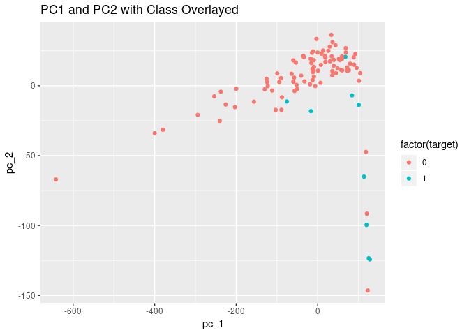

How Effective is Principal Component Analysis?
================
Zach Schuster
November 14, 2018

I’d like to understand how effective preprocessing a data set using PCA
is for binary classification. To do this, I will use a data set with
information on pulsar stars and a binary label. The data can be found
[here on
Kaggle](https://www.kaggle.com/pavanraj159/predicting-a-pulsar-star).

In addition, I will use the data.table package for any necessary data
manipulation.

-----

## Exploration

``` r
stars = fread("pulsar_stars.csv", header = TRUE)

# take a look at the data
knitr::kable(head(stars), digits = 2)
```

| Mean of the integrated profile | Standard deviation of the integrated profile | Excess kurtosis of the integrated profile | Skewness of the integrated profile | Mean of the DM-SNR curve | Standard deviation of the DM-SNR curve | Excess kurtosis of the DM-SNR curve | Skewness of the DM-SNR curve | target\_class |
| -----------------------------: | -------------------------------------------: | ----------------------------------------: | ---------------------------------: | -----------------------: | -------------------------------------: | ----------------------------------: | ---------------------------: | ------------: |
|                         140.56 |                                        55.68 |                                    \-0.23 |                             \-0.70 |                     3.20 |                                  19.11 |                                7.98 |                        74.24 |             0 |
|                         102.51 |                                        58.88 |                                      0.47 |                             \-0.52 |                     1.68 |                                  14.86 |                               10.58 |                       127.39 |             0 |
|                         103.02 |                                        39.34 |                                      0.32 |                               1.05 |                     3.12 |                                  21.74 |                                7.74 |                        63.17 |             0 |
|                         136.75 |                                        57.18 |                                    \-0.07 |                             \-0.64 |                     3.64 |                                  20.96 |                                6.90 |                        53.59 |             0 |
|                          88.73 |                                        40.67 |                                      0.60 |                               1.12 |                     1.18 |                                  11.47 |                               14.27 |                       252.57 |             0 |
|                          93.57 |                                        46.70 |                                      0.53 |                               0.42 |                     1.64 |                                  14.55 |                               10.62 |                       131.39 |             0 |

For more efficient use of space, I will rename the columns

``` r
new_names = c("mean_IP","sd_IP","ek_IP","skew_IP",
              "mean_DM-SNR", "sd_DM-SNR", "ek_DM-SNR", "skew_DM-SNR",
              "target")
setnames(stars, names(stars), new_names)
```

It looks like we have 8 numeric columns of predictor variables. When
looking further, there are two sets of 4 columns that take measurements
on the “integrated profile” and the “DM-SNR”. It is possible that
variables are correlated with eachother.

``` r
GGally::ggpairs(stars[, !"target"])
```

<!-- -->

As we expected, measures related to either the integrated profile or
DM-SNR are highly correlated while their is not much correlation between
measures on integrated profile and measures on SM-SNR.

This may be a good scenario for PCA\!

-----

### Class Distribution

Something we should note, and an added complication is the imbalanced
class distribution.

``` r
table(stars$target)
```

    ## 
    ##     0     1 
    ## 16259  1639

``` r
round(table(stars$target)/length(stars$target), 3)*100
```

    ## 
    ##    0    1 
    ## 90.8  9.2

Here we see that only 9.2% of observations are actually pulsar stars\!
This provides an opportunity test out some sort of sampling.

## PCA

For the sake of learning, let’s manually run PCA (except for the eigen
decomposition\!) and project into 8 dimensions (the same as the original
data set).

``` r
# split data into target and covariates
target = stars[["target"]]
X = stars[, !"target"]

# compute covariance matrix
cov_X = cov(X)

# compute eigen vals and eigen vectors
eigens = eigen(cov_X)

PCA = as.data.table(cbind(scale(X, scale = FALSE) %*% eigens$vectors, target))
setnames(PCA, names(PCA), c(paste("pc", 1:8, sep = "_"), "target"))

# take a look at the head of our new data set
knitr::kable(head(PCA), digits = 2,
             caption = "Principle Components")
```

|    pc\_1 |   pc\_2 |   pc\_3 |  pc\_4 |  pc\_5 |  pc\_6 |  pc\_7 |  pc\_8 | target |
| -------: | ------: | ------: | -----: | -----: | -----: | -----: | -----: | -----: |
|    27.19 |   29.68 |   19.48 | \-3.04 |   3.12 | \-4.33 | \-0.04 |   0.01 |      0 |
|  \-24.48 |    6.02 | \-11.39 | \-5.34 |  14.00 | \-2.18 |   0.66 | \-0.01 |      0 |
|    39.94 |   10.83 | \-14.77 | \-2.10 | \-4.44 |   3.47 |   0.10 |   0.13 |      0 |
|    48.00 |   29.83 |   16.33 | \-2.84 |   5.30 | \-4.49 | \-0.35 | \-0.06 |      0 |
| \-147.92 | \-18.56 | \-22.30 | \-1.58 | \-0.32 |   3.92 |   0.25 |   0.08 |      0 |
|  \-28.07 |    0.47 | \-20.92 | \-5.23 |   4.39 |   2.10 |   0.47 |   0.06 |      0 |

Principle Components

## Cumulative Variance Explained by Component

We can build a nice plot to visualize how much variation is explained by
each component.

``` r
norm_eig_values = eigens$values/sum(eigens$values)
cum_sum = cumsum(norm_eig_values)


ggplot(mapping = aes(x = 1:length(norm_eig_values), y = norm_eig_values)) +
    geom_bar(stat = "identity", fill = "orange") + 
    geom_point(aes(y = cum_sum)) + 
    geom_line(aes(y = cum_sum), col = "blue") +
    labs(title = "Variation Explained by Principal Component",
         x = "Principal Component",
         y = "Percent of Total Variation")
```

<!-- -->

This is a nice visualization to see that we can explain about 95% of the
variation with just two principal components\!

-----

A fun side note. By construction, PCA creates orthogonal features, which
means our covariance matrix of the newly contructed features should be a
diagonal matrix. Is this the case?

``` r
round(cov(PCA[, !"target"]), 3)
```

    ##          pc_1     pc_2    pc_3   pc_4   pc_5   pc_6  pc_7  pc_8
    ## pc_1 11635.08    0.000   0.000  0.000  0.000  0.000 0.000 0.000
    ## pc_2     0.00 1044.468   0.000  0.000  0.000  0.000 0.000 0.000
    ## pc_3     0.00    0.000 549.744  0.000  0.000  0.000 0.000 0.000
    ## pc_4     0.00    0.000   0.000 82.278  0.000  0.000 0.000 0.000
    ## pc_5     0.00    0.000   0.000  0.000 32.555  0.000 0.000 0.000
    ## pc_6     0.00    0.000   0.000  0.000  0.000 12.804 0.000 0.000
    ## pc_7     0.00    0.000   0.000  0.000  0.000  0.000 0.522 0.000
    ## pc_8     0.00    0.000   0.000  0.000  0.000  0.000 0.000 0.037

It is\!

-----

Before we make any predictions, it’d be interesting to visualize
components to see how seperable the classes are.

because we have almost 18,000 observations, I’ll take a sample of each
class to simulate the class distribution on a smaller scale

``` r
pos = PCA[target == 1]
neg = PCA[target == 0]

# lets sample 100 data points
num_samples = 100
pos = pos[sample(1:nrow(pos), .09*num_samples)]
neg = neg[sample(1:nrow(neg), .91*num_samples)]
reduced_PCA = rbindlist(list(pos, neg))

ggplot(reduced_PCA, aes(x = pc_1, y = pc_2)) +
    geom_point(aes(col = factor(target))) +
    ggtitle("PC1 and PC2 with Class Overlayed")
```

<!-- -->

Interestingly, there doesn’t appear to be much of a linear separation
(or non linear for that matter) between the classes. **Hopefully this
improves when we do some sampling later on. keep this?**

### Building training and test sets

The process is as follows

  - split data into training and testing sets (with even target
    distribution)
  - compute projection matrix for training set and transform training
    set
  - transform testing set using computed projection matrix from previous
    step

<!-- end list -->

``` r
# training set proportion
prop = .7

pos = stars[target == 1]
neg = stars[target == 0]
pos_ind = sample.int(nrow(pos), round(prop*nrow(pos)))
neg_ind = sample.int(nrow(neg), round(prop*nrow(neg)))

train = rbind(pos[pos_ind], neg[neg_ind])
train[, target := as.factor(target)]

test = rbind(pos[-pos_ind], neg[-neg_ind])
test[, target := as.factor(target)]
```

We have our training and testing sets which we can use for the duration
of the analysis.

### PCA vs full features using Random Forest

``` r
# number of pricipal components that you'd like to compute
num_pcs = 5

train_x = train[, !"target"]
train_y = train[, "target"]

# compute covariance
train_cov = cov(train_x)

# compute eigen decomposition on covariance matrix
eigen_train = eigen(train_cov)

scaled_train = scale(train_x, scale = FALSE)
train_pca = scaled_train %*% eigen_train$vectors[, 1:num_pcs]

train_pca = cbind(train_pca, train_y)
setnames(train_pca, names(train_pca)[1:num_pcs],
         paste("pc", 1:num_pcs, sep = "_"))

knitr::kable(head(train_pca), digits = 2, 
             caption = "Projected Training Set")
```

|  pc\_1 |    pc\_2 |   pc\_3 |   pc\_4 |   pc\_5 | target |
| -----: | -------: | ------: | ------: | ------: | :----- |
| 120.85 | \-110.20 | \-39.56 | \-10.00 |   13.24 | 1      |
| 113.87 |  \-78.18 | \-70.77 |    7.14 | \-12.05 | 1      |
| 125.78 | \-126.48 |   45.27 | \-21.48 |    0.39 | 1      |
| 123.28 | \-130.51 | \-37.94 | \-21.38 | \-10.96 | 1      |
| 123.10 | \-117.42 | \-36.53 |    0.11 |  \-4.71 | 1      |
| 114.24 |  \-83.71 | \-24.27 | \-16.60 |    4.90 | 1      |

Projected Training Set

Above we have our transformed training set. Next we transform our
testing set.

``` r
test_x = test[, !"target"]
test_y = test[, .(target)]

transformed_test = scale(test_x, center = attr(scaled_train, "scaled:center"),
                       scale = FALSE) %*% eigen_train$vectors[, 1:num_pcs]

test_pca = cbind(transformed_test, test_y)
test_pca[, target := as.factor(target)]

setnames(test_pca, names(test_pca)[1:num_pcs],
         paste("pc", 1:num_pcs, sep = "_"))

knitr::kable(head(test_pca), digits = 2,
             caption = "Projected Test Set")
```

|    pc\_1 |    pc\_2 |   pc\_3 |   pc\_4 |   pc\_5 | target |
| -------: | -------: | ------: | ------: | ------: | :----- |
| \-109.85 |     2.75 |    4.12 |  \-1.14 |  \-2.37 | 1      |
|   116.37 |  \-89.64 | \-47.58 |  \-1.67 | \-12.41 | 1      |
|    75.30 |     6.23 | \-21.02 |    1.92 |  \-6.62 | 1      |
|   114.58 |  \-79.05 | \-66.14 |   11.93 | \-10.69 | 1      |
|   130.77 | \-179.89 |    7.63 | \-34.77 |  \-7.80 | 1      |
|   111.72 |  \-52.68 | \-39.74 |   12.72 |    0.97 | 1      |

Projected Test Set

Great\! Now we have our training and test sets projected onto a new
feature space. We’ve used the first two principal components here.

-----

Now we can train our random forest\!

``` r
RF_pca_no_samp = randomForest(x = train_pca[, !"target"],
                              y = train_pca[, target],
                              ntree = 1000, importance = TRUE)

varImpPlot(RF_pca_no_samp, type = 2,
           main = "Decrease in Gini")
```

<!-- -->

Above we have a simple plot showing that, to no surprise, pc\_1 was the
more important feature between pc\_1 and pc\_2.

-----

We can now test our random forest trained on transformed data.

``` r
preds_pca = predict(RF_pca_no_samp, newdata = test_pca[, !"target"],
                    type = "prob")[, 2]

# get performance of model
pred_obj = prediction(preds_pca, test_pca[, target])
c(AUC = performance(pred_obj, measure = "auc")@y.values[[1]])
```

    ##       AUC 
    ## 0.9665853

``` r
# as.numeric(as.character(test_pca[, target]))
```

An AUC of .94 is really good\! We don’t know how good that is until we
compare it to a data set using all of the features. **For comparison, we
will use the exact same training and testing observations**.

``` r
RF_no_samp = randomForest(x = train[, !"target"],
                          y = train[, target],
                          ntree = 1000, importance = TRUE)

varImpPlot(RF_no_samp, type = 2,
           main = "Decrease in Gini")
```

<!-- -->

Here we can see that the most important feature is the excess kurtosis
of the integrated profile.

``` r
preds = predict(RF_no_samp, newdata = test[, !"target"],
                type = "prob")[, 2]

# get performance of model
pred_obj = prediction(preds, test[, target])
c(AUC = performance(pred_obj, measure = "auc")@y.values[[1]])
```

    ##       AUC 
    ## 0.9766325

An AUC of .97 is exceptional. That being said, using only 2 features
instead of 8, we were able to get an AUC within .03 (.97-.94) of the
model built on the entire data set\!

This is a great demonstration of the power of PCA for the purpose of
dimension reduction.
