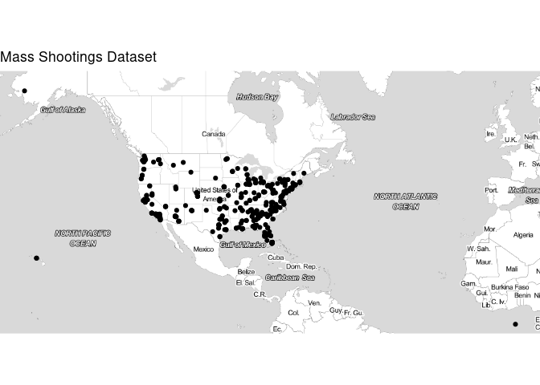
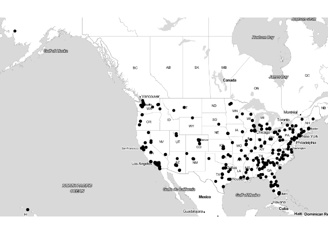
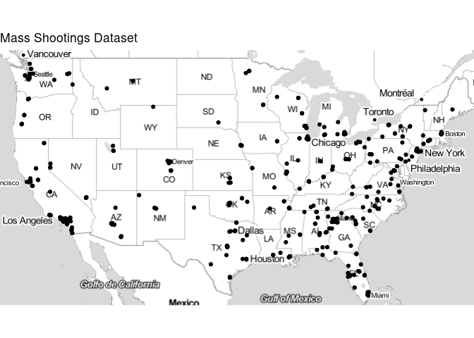
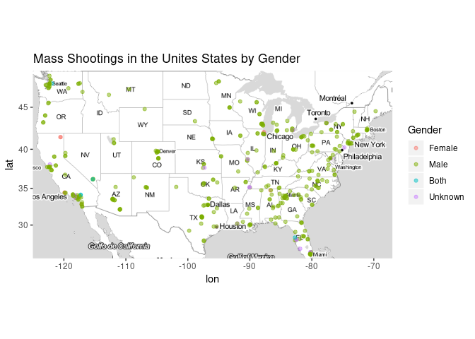
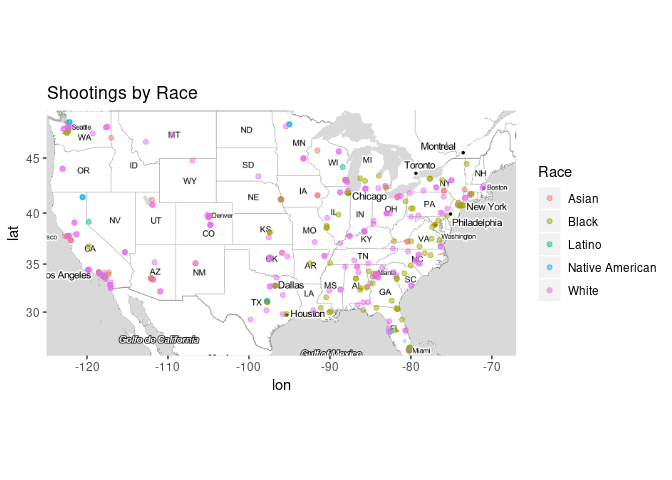
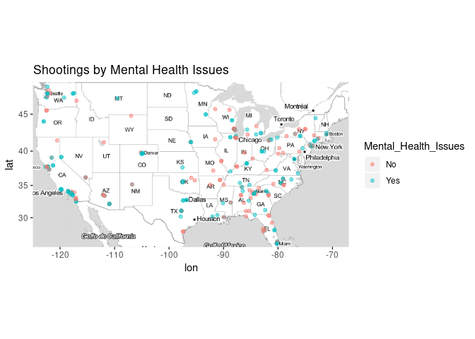
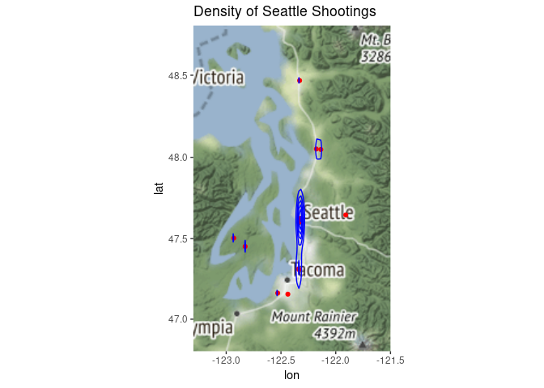

Working with Spatial Data
================
Zach Schuster
November 14, 2018

The purpose of this file is to explore and visualize US mass shootings
between the last quarter of 2011 and the first day of 2015. The data
used is below:

  - MassShootingsDataset.csv

In addition, we will call the below API to query coordinates when they
are missing but we have the location.

  - Texas A\&M Geo Services

First read in the data and explore

``` r
shootings = fread("Mass_Shootings_Dataset.csv", header = TRUE,
                  na.strings = c(""))

# How many na values are there?
vapply(shootings, function(x) sum(is.na(x)),
       FUN.VALUE = integer(1))
```

    ##                   S#                Title             Location 
    ##                    0                    0                    0 
    ##                 Date              Summary           Fatalities 
    ##                    0                    1                    0 
    ##              Injured        Total victims Mental Health Issues 
    ##                    0                    0                    0 
    ##                 Race               Gender             Latitude 
    ##                    3                    1                   20 
    ##            Longitude 
    ##                   20

We can see that we have 20 rows where longitute and latitude are
missing, but the location is present. Can we query an API to find these
coordinates?

To do so, we will subset out the rows we need to fill in and then bind
them back to the original data once we have a full data set.

``` r
to_fill = shootings[is.na(Latitude) | is.na(Longitude)]

# remove to_fill rows from shootings
shootings = shootings[!to_fill, on = names(shootings)]

# There should not be any overlap between to_fill and shootings
intersect(to_fill, shootings)
```

    ## Null data.table (0 rows and 0 cols)

Good\! There is no overlap between the two tables. Now we can write code
to fill in the missing coordinates

Just a few more steps. It’ll be easier when we query to have a city and
a state column…

``` r
cityState = tstrsplit(to_fill$Location, split = ",")
```

We can write a function where we will feed in a vector of cities and a
vector of states and get back a list of latitudes and longitudes.

``` r
getCoords = function(City, State){
  
  #flatten City and State if need be
  City = unlist(City)
  State = unlist(State)
  
  # we need to replace any spaces in the categories with "%20"
  City = gsub("\\s+", "%20", trimws(City))
  State = gsub("\\s+", "%20", trimws(State))
  
  # make sure city and state are of equal length
  stopifnot(length(City) == length(State))
  
  # define constants
  baseQuery = "https://geoservices.tamu.edu/Services/Geocode/WebService/GeocoderWebServiceHttpNonParsed_V04_01.aspx?"
  apiKey = paste("apiKey=", key, sep = "")
  version = "version=4.01"
  format = "format=csv"
  header = "includeHeader=true"
  
  latLon = lapply(seq_along(City), function(i){
  
    # define parameters
    city = paste("city=", City[i], sep = "")
    state = paste("state=", State[i], sep = "")
    
    options = paste(apiKey, version, city, state, format, header, sep = "&")
    
    # query API
    results = fread(paste0(baseQuery, options), verbose = FALSE,
                    showProgress = FALSE)
    
    # return latitude and longitude
    return(c(results$Latitude, results$Longitude))
  })
  
  return(setNames(transpose(latLon), c("Latitude", "Longitude")))

}

# we can transpose the list to make it cleaner
(coords = getCoords(cityState[[1]], cityState[[2]]))
```

    ## $Latitude
    ##  [1] 36.22771 37.75971 41.54124 28.41589 39.94987 36.78267 26.14084
    ##  [8] 48.46767 30.45077 32.79464 28.41589 38.14037 42.27491 34.13970
    ## [15] 38.86726 38.86726 43.26473 44.21353 34.40006  0.00000
    ## 
    ## $Longitude
    ##  [1] -115.26404 -122.69398  -75.94874  -81.29875  -82.59818 -119.79449
    ##  [7]  -80.14370 -122.32982  -91.12585  -96.76634  -81.29875  -97.42166
    ## [13]  -85.58816 -117.29423 -104.76075 -104.76075 -123.30348  -88.42738
    ## [19] -119.71344    0.00000

Now that we have our latitude and logitudes, we can update the
data.table `to_fill` and bind the rows back to the shootings data.table.

``` r
# fill latitude and logitude
to_fill[, (c("Latitude", "Longitude")) := coords]

# bind to shootings and order by date
shootings = rbind(shootings, to_fill)[order(Date)]
```

I’m not too worried about the one missing summary, but let’s take a look
at the missing race and gender
    observations.

``` r
shootings[is.na(Race) | is.na(Gender), !"Summary"]
```

    ##    S#                                Title         Location      Date
    ## 1:  1        Las Vegas Strip mass shooting    Las Vegas, NV 10/1/2017
    ## 2:  4 Florida awning manufacturer shooting Orlando, Florida  6/5/2017
    ## 3:  8                Cascade Mall shooting   Burlington, WA 9/23/2016
    ##    Fatalities Injured Total victims Mental Health Issues Race Gender
    ## 1:         58     515           573              Unclear <NA>   <NA>
    ## 2:          5       0             5              Unclear <NA>      M
    ## 3:          5       0             5                  Yes <NA>      M
    ##    Latitude  Longitude
    ## 1: 36.22771 -115.26404
    ## 2: 28.41589  -81.29875
    ## 3: 48.46767 -122.32982

The las vegas shooting involved a male, so we can fill that in. The Race
we will leave as NA for now.

``` r
shootings[is.na(Gender), Gender := "M"]
```

## Visualizing Shootings

The `ggmap` package will be used for geographical plotting.

Initially, let’s look at a simple map of all the shootings in the
dataset.

``` r
qmplot(Longitude, Latitude,
       data = shootings, maptype = "toner-lite",
       main = "Mass Shootings Dataset")
```

<!-- -->

Here we see that there appears to be one incident in Alaska and one in
Hawaii, which is why the map is do zoomed out. One point (bottom right
of map) looks to be in the ocean. Let’s
    investigate.

``` r
shootings[Longitude > -25, !"Summary"]
```

    ##     S#                Title         Location     Date Fatalities Injured
    ## 1: 168 Fort Hood shooting 2 Fort Hood, Texas 4/3/2014          3      12
    ##    Total victims Mental Health Issues   Race Gender Latitude Longitude
    ## 1:            15              Unclear Latino      M        0         0

There must be an error as Fort Hood definitely does not have coordinates
of (0, 0)\! This could be a security feature as the API I called
returned (0, 0)\! We can use another observation since there are
multiple entries for Fort Hood

``` r
Loc = shootings[Location == "Fort Hood, Texas" & Latitude > 0][1]
Loc = Loc[,.(Latitude, Longitude)]

shootings[Longitude > -25, `:=`(Latitude = Loc$Latitude,
                                Longitude = Loc$Longitude)]

shootings[Location == "Fort Hood, Texas"]
```

    ##     S#                Title         Location      Date
    ## 1: 229   Fort Hood massacre Fort Hood, Texas 11/5/2009
    ## 2: 230  Fort Hood Army Base Fort Hood, Texas 11/5/2009
    ## 3: 168 Fort Hood shooting 2 Fort Hood, Texas  4/3/2014
    ##                                                                                                                                                                                                                                                                                                          Summary
    ## 1:                                                                                                                                       Army psychiatrist Nidal Malik Hasan, 39, opened fire on an Army base in an attack linked to Islamist extremism. Hasan was injured during the attack and later arrested.
    ## 2:                                                               On November 5, 2009, a 39-year old U.S. Army psychiatrist fatally shot thirteen people and injured thirty-two at Fort Hood Army Base located in Killeen, Texas. He was shot and wounded by another soldier and arrested as he fell unconscious.
    ## 3: Army Specialist Ivan Lopez, 34, opened fire at the Fort Hood Army Post in Texas, killing three and wounding at least 12 others before shooting himself in the head after engaging with military police. Lt. Gen. Mark A. Milley told reporters that Lopez ""had behavioral health and mental health"" issues.
    ##    Fatalities Injured Total victims Mental Health Issues
    ## 1:         13      30            43              Unclear
    ## 2:         13      32            45                  Yes
    ## 3:          3      12            15              Unclear
    ##                                   Race Gender Latitude Longitude
    ## 1:                               Other   Male 31.20113 -97.77157
    ## 2: White American or European American   Male 31.13814 -97.77798
    ## 3:                              Latino      M 31.20113 -97.77157

Great\! Our map should look better now.

``` r
qmplot(Longitude, Latitude,
       data = shootings, maptype = "toner-lite",
       "Mass Shootings Dataset")
```

    ## Warning: Ignoring unknown parameters: NA

<!-- -->

It may make our analysis easier if we remove the incidents from AK and
HI.

``` r
shootings = shootings[!(grepl("Hawaii", Location, fixed = TRUE) | 
                          grepl("Alaska", Location, fixed = TRUE))]
```

``` r
qmplot(Longitude, Latitude,
       data = shootings, maptype = "toner-lite",
       main = "Mass Shootings Dataset")
```

<!-- -->

I think we are now able to get a good picture of the lower 48 US
States\!

-----

From here, how can we get a better idea of the shootings we have seen
using color?

We can plot the shootings on a map using color to show gender.

**Note: We will use the toner-lite map type as it is difficult to
visualize points on terrain type maps.**

``` r
us = c(left = -125, bottom = 25.25, right = -67, top = 49)
map = get_stamenmap(us, maptype = "toner-lite", zoom = 4)

# recode gender
shootings[, Gender := forcats::fct_collapse(Gender,
                                            Male = c("Male", "M"),
                                            Both = c("M/F", "Male/Female"))]

# create map
ggmap(map) + 
  geom_point(aes(x = Longitude, y = Latitude, colour = Gender),
             data = shootings, alpha = .5) +
  ggtitle("Mass Shootings in the Unites States by Gender")
```

<!-- -->

Using the alpha parameter to make points somewhat transparent helps
visualize areas of high density. To no surprise, it looks like major
metropolitan areas such as Los Angeles, Seattle, Atlanta, and New York
are areas where many shootings occur.

``` r
shootings[, sort(table(Location), decreasing = TRUE)][1:5]
```

    ## Location
    ##        Seattle, Washington             Killeen, Texas 
    ##                          6                          5 
    ## Colorado Springs, Colorado              Dallas, Texas 
    ##                          4                          4 
    ##            Omaha, Nebraska 
    ##                          4

After looking at a table, Seattle has the most shootings in the data
set.

We can also see that the shooters are predominantly male.

``` r
# Percentage of each Gender
round(table(shootings$Gender)/length(shootings$Gender), 2)
```

    ## 
    ##  Female    Male    Both Unknown 
    ##    0.02    0.91    0.01    0.06

-----

We could do the same analysis for Race

``` r
shootings[, Race := 
            forcats::fct_collapse(Race,
                                  Asian = c("Asian", "Asian American",
                                            "Asian American/Some other race"),
                                  Black = c("black", "Black",
                                            "Black American or African American",
                                            "Black American or African American/Unknown"),
                                  `Native American` = c("Native American",
                                                        "Native American or Alaska Native"),
                                  Unclear = c("Other", "Some other race",
                                              "Two or more races", "unclear",
                                              "Unknown"),
                                  White = c("white", "White",
                                            "White American or European American",
                                            "White American or European American/Some other Race"))]

# look at a table of race to verify the code worked properly
shootings[, table(Race)]
```

    ## Race
    ##           Asian           Black          Latino Native American 
    ##              22              94               7               6 
    ##         Unclear           White 
    ##              76             187

After collapsing levels of Race, we see that Whites have been the
criminals far more often than any other race. Let’s plot shooting on a
map by Race. I will exclude the unclear races.

``` r
ggmap(map) + 
  geom_point(aes(x = Longitude, y = Latitude, colour = Race),
             data = shootings[Race != "Unclear"],
             alpha = .5) +
  ggtitle("Shootings by Race")
```

<!-- -->

I think the results are difficult to interpret if we don’t know exactly
what we’re looking for. As expected, we do see a lot of pink points
which correspond to white shooters.

-----

We can try to see if there is a visual pattern in shootings that occured
by those with mental health issues compared to those without. We will
only look at shootings where we know whether or not there were metal
health issues.

``` r
# relevel the mental health issues column
shootings[, Mental_Health_Issues := 
            forcats::fct_collapse(`Mental Health Issues`,
                                  Unknown = c("Unclear", "unknown", "Unknown"))]
shootings[, `Mental Health Issues` := NULL]

# create map
ggmap(map) + 
  geom_point(aes(x = Longitude, y = Latitude, colour = Mental_Health_Issues),
             data = shootings[Mental_Health_Issues != "Unknown"],
             alpha = .5) +
  ggtitle("Shootings by Mental Health Issues")
```

<!-- -->

There don’t appear to be any major visual patterns. I spent four year in
Tampa, FL for my undergraduate degree. It is interesting to see that
almost all incidents around that area happened by people without mental
health issues.

-----

Lastly, we could zoom in on a certain area, Seattle, and overlay a
density plot

``` r
seattle = c(left = -123.3, bottom = 46.8, right = -121.5, top = 48.8)
map_seattle = get_stamenmap(seattle, zoom = 7)

# create subset for faster plotting
seattleISH = shootings[Longitude < -120 & Latitude > 47]

ggmap(map_seattle) +
  geom_point(aes(x = Longitude, y = Latitude), data = seattleISH, col = "red") +
  geom_density2d(aes(x = Longitude, y = Latitude), data = seattleISH,
                 col = "blue") + 
  ggtitle("Density of Seattle Shootings")
```

<!-- -->

Although the graphic is not perfect due to the sparsity of data outside
of Seattle, we can see how much denser Seattle is than any of the
surrounding areas.

## Plotly Interactive Maps

Example code is below. The map is not shown as it can only be used in an
html format (which this .md file is not)

``` r
# geo styling
g <- list(
  scope = 'usa',
  projection = list(type = 'albers usa'),
  showland = TRUE,
  landcolor = toRGB("gray95"),
  subunitcolor = toRGB("gray85"),
  countrycolor = toRGB("gray85"),
  countrywidth = 0.5,
  subunitwidth = 0.5
)

# make plot and hover information
p <- plot_geo(shootings, lat = ~Latitude, lon = ~Longitude) %>%
  add_markers(
    text = ~paste(Title, Location, Date, paste("Deaths:", Fatalities),
                  sep = "<br />"),
    hoverinfo = "text"
  ) %>%
  layout(
    title = 'US Mass Shootings<br />(Hover for info)', geo = g
  )

# show plot
p
```

## Future Ideas

  - Use plotly to create interactive maps. We could show information on
    each shooting when a cursor hovers over it and much more given the
    time.
  - Create a Google Maps API key to overlay points on Google Maps, which
    would show more detail.

*Some of the ideas and methods from this analysis were adapted from the
[ggmap github page](https://github.com/dkahle/ggmap) and [this plotly
tutorial](https://plot.ly/r/scatter-plots-on-maps/). Thank you for great
examples\!*

**This short analysis has been an exercise in plotting spatial data.
Please let me know if you have any suggestions. I’m always interested in
better and more efficient programming practices\!**
