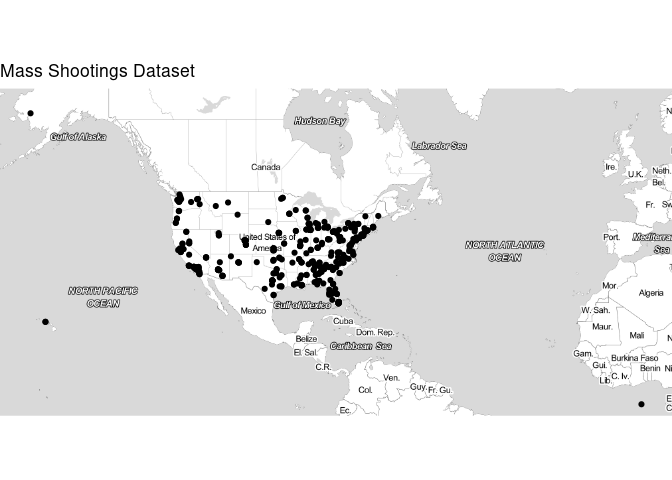

Working with Spatial Data
================
Zach Schuster
November 14, 2018

The purpose of this file is to explore and visualize US mass shootings
between the last quarter of 2011 and the first day of 2015. The data
used is below:

  - MassShootingsDataset.csv

In addition, we will call the below API to query coordinates when they
are missing but we have the location.

  - Texas A\&M Geo Services

First read in the data and explore

``` r
shootings = fread("Mass_Shootings_Dataset.csv", header = TRUE,
                  na.strings = c(""))

# How many na values are there?
vapply(shootings, function(x) sum(is.na(x)),
       FUN.VALUE = integer(1))
```

    ##                   S#                Title             Location 
    ##                    0                    0                    0 
    ##                 Date              Summary           Fatalities 
    ##                    0                    1                    0 
    ##              Injured        Total victims Mental Health Issues 
    ##                    0                    0                    0 
    ##                 Race               Gender             Latitude 
    ##                    3                    1                   20 
    ##            Longitude 
    ##                   20

We can see that we have 20 rows where longitute and latitude are
missing, but the location is present. Can we query an API to find these
coordinates?

To do so, we will subset out the rows we need to fill in and then bind
them back to the original data once we have a full data set.

``` r
to_fill = shootings[is.na(Latitude) | is.na(Longitude)]

# remove to_fill rows from shootings
shootings = shootings[!to_fill, on = names(shootings)]

# There should not be any overlap between to_fill and shootings
intersect(to_fill, shootings)
```

    ## Null data.table (0 rows and 0 cols)

Good\! There is no overlap between the two tables. Now we can write code
to fill in the missing coordinates

Just a few more steps. It’ll be easier when we query to have a city and
a state column…

``` r
cityState = tstrsplit(to_fill$Location, split = ",")
```

We can write a function where we will feed in a vector of cities and a
vector of states and get back a list of latitudes and longitudes.

``` r
getCoords = function(City, State){
  
  #flatten City and State if need be
  City = unlist(City)
  State = unlist(State)
  
  # we need to replace any spaces in the categories with "%20"
  City = gsub("\\s+", "%20", trimws(City))
  State = gsub("\\s+", "%20", trimws(State))
  
  # make sure city and state are of equal length
  stopifnot(length(City) == length(State))
  
  # define constants
  baseQuery = "https://geoservices.tamu.edu/Services/Geocode/WebService/GeocoderWebServiceHttpNonParsed_V04_01.aspx?"
  apiKey = paste("apiKey=", key, sep = "")
  version = "version=4.01"
  format = "format=csv"
  header = "includeHeader=true"
  
  latLon = lapply(seq_along(City), function(i){
  
    # define parameters
    city = paste("city=", City[i], sep = "")
    state = paste("state=", State[i], sep = "")
    
    options = paste(apiKey, version, city, state, format, header, sep = "&")
    
    # query API
    results = fread(paste0(baseQuery, options), verbose = FALSE,
                    showProgress = FALSE)
    
    # return latitude and longitude
    return(c(results$Latitude, results$Longitude))
  })
  
  return(setNames(transpose(latLon), c("Latitude", "Longitude")))

}

# we can transpose the list to make it cleaner
(coords = getCoords(cityState[[1]], cityState[[2]]))
```

    ## $Latitude
    ##  [1] 36.22771 37.75971 41.54124 28.41589 39.94987 36.78267 26.14084
    ##  [8] 48.46767 30.45077 32.79464 28.41589 38.14037 42.27491 34.13970
    ## [15] 38.86726 38.86726 43.22205 44.21353 34.40006  0.00000
    ## 
    ## $Longitude
    ##  [1] -115.26404 -122.69398  -75.94874  -81.29875  -82.59818 -119.79449
    ##  [7]  -80.14370 -122.32982  -91.12585  -96.76634  -81.29875  -97.42166
    ## [13]  -85.58816 -117.29423 -104.76075 -104.76075 -123.35224  -88.42738
    ## [19] -119.71344    0.00000

Now that we have our latitude and logitudes, we can update the
data.table `to_fill` and bind the rows back to the shootings data.table.

``` r
# fill latitude and logitude
to_fill[, (c("Latitude", "Longitude")) := coords]

# bind to shootings and order by date
shootings = rbind(shootings, to_fill)[order(Date)]
```

I’m not too worried about the one missing summary, but let’s take a look
at the missing race and gender
    observations.

``` r
shootings[is.na(Race) | is.na(Gender), !"Summary"]
```

    ##    S#                                Title         Location      Date
    ## 1:  1        Las Vegas Strip mass shooting    Las Vegas, NV 10/1/2017
    ## 2:  4 Florida awning manufacturer shooting Orlando, Florida  6/5/2017
    ## 3:  8                Cascade Mall shooting   Burlington, WA 9/23/2016
    ##    Fatalities Injured Total victims Mental Health Issues Race Gender
    ## 1:         58     515           573              Unclear <NA>   <NA>
    ## 2:          5       0             5              Unclear <NA>      M
    ## 3:          5       0             5                  Yes <NA>      M
    ##    Latitude  Longitude
    ## 1: 36.22771 -115.26404
    ## 2: 28.41589  -81.29875
    ## 3: 48.46767 -122.32982

The las vegas shooting involved a male, so we can fill that in. The Race
we will leave as NA for now.

``` r
shootings[is.na(Gender), Gender := "M"]
```

## Visualizing Shootings

The `ggmap` package will be used for geographical plotting.

Initially, let’s look at a simple map of all the shootings in the
dataset.

``` r
qmplot(Longitude, Latitude,
       data = shootings, maptype = "toner-lite",
       main = "Mass Shootings Dataset")
```

<!-- -->

Here we see that there appears to be one incident in Alaska and one in
Hawaii, which is why the map is do zoomed out. One point (bottom right
of map) looks to be in the ocean. Let’s
    investigate.

``` r
shootings[Longitude > -25, !"Summary"]
```

    ##     S#                Title         Location     Date Fatalities Injured
    ## 1: 168 Fort Hood shooting 2 Fort Hood, Texas 4/3/2014          3      12
    ##    Total victims Mental Health Issues   Race Gender Latitude Longitude
    ## 1:            15              Unclear Latino      M        0         0

There must be an error as Fort Hood definitely does not have coordinates
of (0, 0)\! This could be a security feature as the API I called
returned (0, 0)\! We can use another observation since there are
multiple entries for Fort Hood

``` r
Loc = shootings[Location == "Fort Hood, Texas" & Latitude > 0][1]
Loc = Loc[,.(Latitude, Longitude)]

shootings[Longitude > -25, `:=`(Latitude = Loc$Latitude,
                                Longitude = Loc$Longitude)]

shootings[Location == "Fort Hood, Texas"]
```

    ##     S#                Title         Location      Date
    ## 1: 229   Fort Hood massacre Fort Hood, Texas 11/5/2009
    ## 2: 230  Fort Hood Army Base Fort Hood, Texas 11/5/2009
    ## 3: 168 Fort Hood shooting 2 Fort Hood, Texas  4/3/2014
    ##                                                                                                                                                                                                                                                                                                          Summary
    ## 1:                                                                                                                                       Army psychiatrist Nidal Malik Hasan, 39, opened fire on an Army base in an attack linked to Islamist extremism. Hasan was injured during the attack and later arrested.
    ## 2:                                                               On November 5, 2009, a 39-year old U.S. Army psychiatrist fatally shot thirteen people and injured thirty-two at Fort Hood Army Base located in Killeen, Texas. He was shot and wounded by another soldier and arrested as he fell unconscious.
    ## 3: Army Specialist Ivan Lopez, 34, opened fire at the Fort Hood Army Post in Texas, killing three and wounding at least 12 others before shooting himself in the head after engaging with military police. Lt. Gen. Mark A. Milley told reporters that Lopez ""had behavioral health and mental health"" issues.
    ##    Fatalities Injured Total victims Mental Health Issues
    ## 1:         13      30            43              Unclear
    ## 2:         13      32            45                  Yes
    ## 3:          3      12            15              Unclear
    ##                                   Race Gender Latitude Longitude
    ## 1:                               Other   Male 31.20113 -97.77157
    ## 2: White American or European American   Male 31.13814 -97.77798
    ## 3:                              Latino      M 31.20113 -97.77157

Great\! Our map should look better now.

``` r
qmplot(Longitude, Latitude,
       data = shootings, maptype = "toner-lite",
       "Mass Shootings Dataset")
```

    ## Warning: Ignoring unknown parameters: NA

<!-- -->

It may make our analysis easier if we remove the incidents from AK and
HI.

``` r
shootings = shootings[!(grepl("Hawaii", Location, fixed = TRUE) | 
                          grepl("Alaska", Location, fixed = TRUE))]
```

``` r
qmplot(Longitude, Latitude,
       data = shootings, maptype = "toner-lite",
       main = "Mass Shootings Dataset")
```

<!-- -->

I think we are now able to get a good picture of the lower 48 US
States\!

-----

From here, how can we get a better idea of the shootings we have seen
using color?

We can plot the shootings on a map using color to show gender.

**Note: We will use the toner-lite map type as it is difficult to
visualize points on terrain type maps.**

``` r
us = c(left = -125, bottom = 25.25, right = -67, top = 49)
map = get_stamenmap(us, maptype = "toner-lite", zoom = 4)

# recode gender
shootings[, Gender := forcats::fct_collapse(Gender,
                                            Male = c("Male", "M"),
                                            Both = c("M/F", "Male/Female"))]

# create map
ggmap(map) + 
  geom_point(aes(x = Longitude, y = Latitude, colour = Gender),
             data = shootings, alpha = .5) +
  ggtitle("Mass Shootings in the Unites States by Gender")
```

<!-- -->

Using the alpha parameter to make points somewhat transparent helps
visualize areas of high density. To no surprise, it looks like major
metropolitan areas such as Los Angeles, Seattle, Atlanta, and New York
are areas where many shootings occur.

``` r
shootings[, sort(table(Location), decreasing = TRUE)][1:5]
```

    ## Location
    ##        Seattle, Washington             Killeen, Texas 
    ##                          6                          5 
    ## Colorado Springs, Colorado              Dallas, Texas 
    ##                          4                          4 
    ##            Omaha, Nebraska 
    ##                          4

After looking at a table, Seattle has the most shootings in the data
set.

We can also see that the shooters are predominantly male.

``` r
# Percentage of each Gender
round(table(shootings$Gender)/length(shootings$Gender), 2)
```

    ## 
    ##  Female    Male    Both Unknown 
    ##    0.02    0.91    0.01    0.06

-----

We could do the same analysis for Race

``` r
shootings[, Race := 
            forcats::fct_collapse(Race,
                                  Asian = c("Asian", "Asian American",
                                            "Asian American/Some other race"),
                                  Black = c("black", "Black",
                                            "Black American or African American",
                                            "Black American or African American/Unknown"),
                                  `Native American` = c("Native American",
                                                        "Native American or Alaska Native"),
                                  Unclear = c("Other", "Some other race",
                                              "Two or more races", "unclear",
                                              "Unknown"),
                                  White = c("white", "White",
                                            "White American or European American",
                                            "White American or European American/Some other Race"))]

# look at a table of race to verify the code worked properly
shootings[, table(Race)]
```

    ## Race
    ##           Asian           Black          Latino Native American 
    ##              22              94               7               6 
    ##         Unclear           White 
    ##              76             187

After collapsing levels of Race, we see that Whites have been the
criminals far more often than any other race. Let’s plot shooting on a
map by Race. I will exclude the unclear races.

``` r
ggmap(map) + 
  geom_point(aes(x = Longitude, y = Latitude, colour = Race),
             data = shootings[Race != "Unclear"],
             alpha = .5) +
  ggtitle("Shootings by Race")
```

<!-- -->

I think the results are difficult to interpret if we don’t know exactly
what we’re looking for. As expected, we do see a lot of pink points
which correspond to white shooters.

-----

We can try to see if there is a visual pattern in shootings that occured
by those with mental health issues compared to those without. We will
only look at shootings where we know whether or not there were metal
health issues.

``` r
# relevel the mental health issues column
shootings[, Mental_Health_Issues := 
            forcats::fct_collapse(`Mental Health Issues`,
                                  Unknown = c("Unclear", "unknown", "Unknown"))]
shootings[, `Mental Health Issues` := NULL]

# create map
ggmap(map) + 
  geom_point(aes(x = Longitude, y = Latitude, colour = Mental_Health_Issues),
             data = shootings[Mental_Health_Issues != "Unknown"],
             alpha = .5) +
  ggtitle("Shootings by Mental Health Issues")
```

<!-- -->

There don’t appear to be any major visual patterns. I spent four year in
Tampa, FL for my undergraduate degree. It is interesting to see that
almost all incidents around that area happened by people without mental
health issues.

-----

Lastly, we could zoom in on a certain area, Seattle, and overlay a
density plot

``` r
seattle = c(left = -123.3, bottom = 46.8, right = -121.5, top = 48.8)
map_seattle = get_stamenmap(seattle, zoom = 7)

# create subset for faster plotting
seattleISH = shootings[Longitude < -120 & Latitude > 47]

ggmap(map_seattle) +
  geom_point(aes(x = Longitude, y = Latitude), data = seattleISH, col = "red") +
  geom_density2d(aes(x = Longitude, y = Latitude), data = seattleISH,
                 col = "blue") + 
  ggtitle("Density of Seattle Shootings")
```

<!-- -->

Although the graphic is not perfect due to the sparsity of data outside
of Seattle, we can see how much denser Seattle is than any of the
surrounding areas.

## Plotly Interactive Maps

``` r
# geo styling
g <- list(
  scope = 'usa',
  projection = list(type = 'albers usa'),
  showland = TRUE,
  landcolor = toRGB("gray95"),
  subunitcolor = toRGB("gray85"),
  countrycolor = toRGB("gray85"),
  countrywidth = 0.5,
  subunitwidth = 0.5
)

p <- plot_geo(shootings, lat = ~Latitude, lon = ~Longitude) %>%
  add_markers(
    text = ~paste(Title, Location, Date, paste("Deaths:", Fatalities),
                  sep = "<br />"),
    hoverinfo = "text"
  ) %>%
  layout(
    title = 'US Mass Shootings<br />(Hover for airport)', geo = g
  )
p
```

<!--html_preserve-->

<div id="htmlwidget-a12d946f0925c3c70923" class="plotly html-widget" style="width:672px;height:480px;">

</div>

<script type="application/json" data-for="htmlwidget-a12d946f0925c3c70923">{"x":{"visdat":{"4927ad8a0f9":["function () ","plotlyVisDat"]},"cur_data":"4927ad8a0f9","attrs":{"4927ad8a0f9":{"lat":{},"lon":{},"alpha_stroke":1,"sizes":[10,100],"spans":[1,20],"x":{},"y":{},"type":"scatter","mode":"markers","text":{},"hoverinfo":"text","inherit":true}},"layout":{"margin":{"b":40,"l":60,"t":25,"r":10},"mapType":"geo","title":"US Mass Shootings<br />(Hover for airport)","geo":{"domain":{"x":[0,1],"y":[0,1]},"scope":"usa","projection":{"type":"albers usa"},"showland":true,"landcolor":"rgba(242,242,242,1)","subunitcolor":"rgba(217,217,217,1)","countrycolor":"rgba(217,217,217,1)","countrywidth":0.5,"subunitwidth":0.5},"hovermode":"closest","showlegend":false},"source":"A","config":{"modeBarButtonsToAdd":[{"name":"Collaborate","icon":{"width":1000,"ascent":500,"descent":-50,"path":"M487 375c7-10 9-23 5-36l-79-259c-3-12-11-23-22-31-11-8-22-12-35-12l-263 0c-15 0-29 5-43 15-13 10-23 23-28 37-5 13-5 25-1 37 0 0 0 3 1 7 1 5 1 8 1 11 0 2 0 4-1 6 0 3-1 5-1 6 1 2 2 4 3 6 1 2 2 4 4 6 2 3 4 5 5 7 5 7 9 16 13 26 4 10 7 19 9 26 0 2 0 5 0 9-1 4-1 6 0 8 0 2 2 5 4 8 3 3 5 5 5 7 4 6 8 15 12 26 4 11 7 19 7 26 1 1 0 4 0 9-1 4-1 7 0 8 1 2 3 5 6 8 4 4 6 6 6 7 4 5 8 13 13 24 4 11 7 20 7 28 1 1 0 4 0 7-1 3-1 6-1 7 0 2 1 4 3 6 1 1 3 4 5 6 2 3 3 5 5 6 1 2 3 5 4 9 2 3 3 7 5 10 1 3 2 6 4 10 2 4 4 7 6 9 2 3 4 5 7 7 3 2 7 3 11 3 3 0 8 0 13-1l0-1c7 2 12 2 14 2l218 0c14 0 25-5 32-16 8-10 10-23 6-37l-79-259c-7-22-13-37-20-43-7-7-19-10-37-10l-248 0c-5 0-9-2-11-5-2-3-2-7 0-12 4-13 18-20 41-20l264 0c5 0 10 2 16 5 5 3 8 6 10 11l85 282c2 5 2 10 2 17 7-3 13-7 17-13z m-304 0c-1-3-1-5 0-7 1-1 3-2 6-2l174 0c2 0 4 1 7 2 2 2 4 4 5 7l6 18c0 3 0 5-1 7-1 1-3 2-6 2l-173 0c-3 0-5-1-8-2-2-2-4-4-4-7z m-24-73c-1-3-1-5 0-7 2-2 3-2 6-2l174 0c2 0 5 0 7 2 3 2 4 4 5 7l6 18c1 2 0 5-1 6-1 2-3 3-5 3l-174 0c-3 0-5-1-7-3-3-1-4-4-5-6z"},"click":"function(gd) { \n        // is this being viewed in RStudio?\n        if (location.search == '?viewer_pane=1') {\n          alert('To learn about plotly for collaboration, visit:\\n https://cpsievert.github.io/plotly_book/plot-ly-for-collaboration.html');\n        } else {\n          window.open('https://cpsievert.github.io/plotly_book/plot-ly-for-collaboration.html', '_blank');\n        }\n      }"}],"cloud":false},"data":[{"lat":[35.10528976,46.73059479,39.739072,37.27537712,41.83928045,37.9577016,37.96631812,37.40264,35.15290522,37.67129418,30.754181,34.052234,40.68996411,41.265922,33.782519,35.92681467,36.7921,36.768209,33.03607062,32.86357277,33.5282865,38.044556,34.436283,34.43606107,33.57145875,33.538652,29.951066,28.039465,26.1408388189939,35.149534,32.2217429,32.15358905,32.27492783,43.22205555,29.03270634,43.2220517619256,36.2277116,40.98213277,41.47657557,33.75432632,33.741176,42.3810555,42.38013875,31.1171194,31.07925506,39.9589,40.04214385,43.06396691,39.54058388,39.253268,48.050824,48.04802409,43.41929117,35.08130744,32.15358905,38.86730659,38.8672553,34.05098834,33.93814348,45.5719072,45.56871416,35.1725658,41.6606893,41.65589405,34.17622092,47.67367375,33.42268696,30.33216122,42.4894801,42.50840203,35.37810374,31.8076,30.4549394,45.65773714,39.98861445,44.96358722,38.86730659,38.8672553,47.155846,47.16267579,44.54994725,31.2011305,31.13814354,41.60713735,31.21094544,37.08506,39.63400851,36.18931923,45.44853107,30.0687242,42.19358268,39.754713,39.69892933,41.4123225,41.41190846,40.39359306,42.31319376,33.7877944,33.78935598,43.06420322,34.13973446,34.1397028118965,47.64628742,34.09026669,42.506484,42.30904091,32.34729571,42.08185369,42.32427392,27.9477595,27.99601861,30.0687242,47.03740653,41.2587317,41.265922,35.77669911,41.3138,40.7267682,40.72662266,39.9622601,39.98861445,39.81087474,43.04093416,35.92681467,27.84887061,40.7606467,40.77787404,34.72827538,41.9294736,41.93172129,37.3688301,37.38344257,47.62199575,34.17622092,33.54961059,38.104086,47.12189424,41.487104,41.4911123,34.7404,42.2354,27.950575,42.291707,42.2749120529089,38.77144,29.760427,33.9412127,33.94104379,34.61025711,31.07925506,33.5927,33.448377,34.17622092,32.3154272,35.226354,38.1368,47.451459,38.1403695990741,37.204442,47.5033,41.58025541,33.5282865,38.6697,35.90434471,42.331427,33.997197,33.67803464,36.27617912,41.9005865,41.90289602,41.09933958,27.950575,34.052234,29.209684,38.5833862,38.57889169,40.4257455,33.71059292,28.4541,43.16103,26.1223084,26.11737018,28.24653304,43.201126,31.04367594,40.217053,42.331427,43.0605671,43.06396691,34.111223,43.045601,43.0104011,31.58036482,26.640628,31.0549687,33.748995,33.42268696,36.18931923,36.44329,26.127586,32.543745,26.127586,38.252665,38.252665,40.826184,47.876346,47.87067289,33.635662,33.635662,37.75457839,35.8209895,35.82083155,47.6229,47.62199575,35.242302,34.759257,36.099039,30.22540212,35.345802,37.36463172,35.33985609,36.13543238,37.540725,32.86357277,37.687176,33.7629969,41.6856325,41.68700845,42.391764,42.391764,34.023243,39.114053,30.22409,39.114053,40.440625,40.441736,35.085334,45.50216511,37.2295733,37.22995471,33.57145875,33.77005,36.7826736,41.878114,29.785785,34.16204,37.8043808,37.79176806,31.07925506,39.6021065,39.59358263,47.3129607,47.30909721,31.07925506,39.290385,28.0331886,27.98388983,41.87617136,39.54231335,36.765971,43.15693027,38.845113,34.02529674,38.744217,27.823713,27.73907518,42.0986867,42.10140103,31.2011305,29.19313443,39.77725479,32.66240106,36.13543238,34.26779152,41.878114,35.085334,35.149534,39.07868761,39.08174985,43.06420322,40.73169648,32.15358905,39.9498745514483,42.10648807,33.66086267,47.6038321,44.0462362,44.05489698,34.4145857,34.4000582164008,39.85566372,38.95130818,44.20455909,47.62199575,41.47657557,33.66086267,42.31269522,33.47316083,41.47657557,44.2135310566131,28.4158857,37.7597149916938,25.94326707,30.33216122,32.788387,32.8129729,30.3321838,47.61864486,47.618456,34.86379864,37.76721,37.84040411,32.7801052,32.79480596,30.0687242,47.62199575,28.4158857,34.008617,34.02319149,46.39761858,41.5412433216867,36.18931923,32.60598014,37.7789601,37.75457839,33.88404244,41.89499946,35.047157,35.09318123,30.4507664986677,32.5520013,32.555556,39.709283,39.72941874,34.05057545,30.21233538,33.57145875,25.8670105,25.85294547,33.7490987,33.7629969,42.96920434,32.7946448614895,41.2281367,32.376081,32.38455246,30.1988873,33.13439925,40.679276,35.46779189,32.86357277,33.83272887,43.1696837,25.796491,25.79653943,35.6672015,35.66889223,44.49022039,37.27823366,41.83928045,36.55605824,41.7759324,41.78013821,36.04099857,42.8858503,42.88027442,39.75344279,35.0529931,35.07997086,32.79480596,35.15290522,29.79705548,33.57145875,47.69618799,35.18322484,38.2542376,38.249432,33.5598586,33.47524551,32.693397,32.74802142,38.874981,38.90480894,44.79051074,40.43948548,43.38682722,41.83928045,48.4676735838762,34.1928952,44.9772995,44.96358722,33.02912644,25.79653943,39.1637984,39.16464203],"lon":[-89.97734924,-116.9990042,-75.539788,-82.09877234,-87.68818145,-121.2907796,-121.3018775,-76.458559,-106.7791378,-97.55070476,-86.572799,-118.243685,-73.8720502,-96.05381421,-117.228648,-79.03850407,-76.3293,-76.287493,-85.0287065,-117.1281628,-86.79550448,-77.286488,-119.8714406,-119.8593619,-112.0904854,-112.185987,-90.071532,-81.949804,-80.1436977013575,-90.04898,-110.926479,-110.9677647,-90.09470655,-123.3522367,-82.65919302,-123.352236051982,-115.2640448,-74.11264731,-81.68051502,-118.0715378,-118.1046356,-76.8705777,-76.86724659,-97.7277959,-97.73392317,-76.0806,-76.30100872,-88.12299758,-119.748291,-84.599655,-122.176918,-122.1359622,-83.95032759,-92.43278275,-110.9677647,-104.7572279,-104.760749,-80.82077527,-117.3948409,-88.9028922,-88.89729022,-111.6585435,-91.5302214,-91.53117986,-118.5399542,-117.4159843,-111.8163202,-81.67576993,-83.1446485,-83.15387427,-87.00610559,-95.8069,-84.25264151,-91.55077175,-82.98904135,-93.26783687,-104.7572279,-104.760749,-122.437031,-122.5296574,-69.70782299,-97.77156996,-97.77797804,-81.46902046,-82.35793452,-88.74422,-79.94839325,-115.3264875,-122.5440133,-89.93147412,-73.36216339,-104.835869,-104.7871863,-73.31142358,-73.31196267,-75.49640881,-84.01868108,-117.8531119,-117.820412,-87.96724385,-117.2942444,-117.294233498983,-121.9088524,-117.8819958,-71.0728306,-71.10271358,-86.26730242,-78.43213922,-71.14080012,-82.458444,-82.44503769,-89.93147412,-109.4844918,-95.9378732,-96.05381421,-95.25996596,-96.0814,-73.6342955,-73.644712,-83.0007065,-82.98904135,-105.173715,-76.14376763,-79.03850407,-82.71058,-111.89109,-111.9312168,-86.6723055,-88.7503647,-88.74814853,-122.0363496,-122.0256185,-122.323646,-118.5399542,-117.6415707,-122.256637,-119.2750699,-120.542237,-120.549091,-88.1383,-85.676,-82.457178,-85.587229,-85.5881584245763,-90.370949,-95.369803,-84.2135309,-84.20985979,-83.52918091,-97.73392317,-112.163,-112.074037,-118.5399542,-95.30501087,-80.836788,-97.4268,-122.826946,-97.4216641726245,-91.876583,-122.931,-81.20812625,-86.79550448,-77.3524,-77.55639964,-83.045754,-117.48548,-117.773628,-80.35501402,-87.8567277,-87.8643021,-80.64631705,-82.457178,-118.243685,-99.786168,-90.406785,-90.42023754,-79.76092565,-84.71564276,-81.4646,-77.610922,-80.1433786,-80.14865708,-82.71690259,-86.238946,-85.8763466,-74.742938,-83.045754,-88.1064787,-88.12299758,-82.867084,-74.984891,-75.0075119,-90.44323475,-81.872308,-85.30100084,-84.387982,-111.8163202,-115.3264875,-108.723281,-80.233104,-86.211913,-80.233104,-85.758456,-85.758456,-74.20862,-95.0169401,-95.00529009,-96.60888,-96.60888,-122.4424343,-90.6682606,-90.67950058,-122.3165,-122.323646,-87.334739,-86.602493,-78.301106,-85.87371301,-79.4170543,-121.9679315,-79.41381725,-95.91316117,-77.436048,-117.1281628,-97.330053,-84.4231328,-72.72983827,-72.73083927,-71.032828,-71.032828,-84.361556,-94.627464,-92.019843,-94.627464,-79.995886,-79.881994,-106.605553,-122.4412759,-80.4139393,-80.42768677,-112.0904854,-118.193739,-119.794492,-87.629798,-95.824396,-86.475543,-122.2708166,-122.2153171,-97.73392317,-104.9877273,-105.0152112,-122.3393665,-122.3357553,-97.73392317,-76.612189,-80.6429695,-80.66662713,-80.12459632,-90.33029852,-78.928344,-77.69300856,-76.874972,-84.61766831,-90.305391,-97.41739794,-97.43073352,-75.9179738,-75.90922294,-97.77156996,-81.10173014,-86.14635359,-85.37706931,-95.91316117,-85.18822422,-87.629798,-106.605553,-90.04898,-121.5475762,-121.5549539,-87.96724385,-74.18417699,-110.9677647,-82.5981764195261,-87.74211141,-84.02688527,-122.3300624,-123.0220289,-123.0075562,-119.8581209,-119.713437668523,-88.93346458,-84.67066339,-88.4484585,-122.323646,-81.68051502,-84.02688527,-83.21293244,-117.696399,-81.68051502,-88.4273800072023,-81.2987497,-122.693975559556,-80.24253243,-81.67576993,-79.933143,-79.96693995,-81.655651,-117.6483587,-117.644099,-79.9996781,-87.5573742,-87.57853755,-96.8000082,-96.76631094,-89.93147412,-122.323646,-81.2987497,-118.494754,-118.4815644,-112.7329333,-75.9487437736562,-115.3264875,-85.48989253,-122.419199,-122.4424343,-117.92785,-87.81941392,-85.311819,-85.23676751,-91.1258464732186,-117.0430813,-117.047656,-104.823488,-104.9825207,-84.06872262,-92.0316453,-112.0904854,-80.29146268,-80.28316975,-84.3901849,-84.4231328,-85.66008902,-96.7663372104079,-111.9675317,-88.68978002,-88.68967949,-97.84415949,-117.0722528,-73.939513,-97.5191631,-117.1281628,-81.8051584,-77.614337,-80.226683,-80.20840397,-97.42937037,-97.41438792,-73.11400628,-79.95816104,-87.68818145,-82.21429551,-72.5214755,-72.51918655,-79.09701201,-87.8631362,-87.90087079,-79.08435956,-78.8787058,-79.03796125,-96.76631094,-106.7791378,-95.36763856,-112.0904854,-95.42844094,-101.8805688,-85.759407,-85.726243,-81.721952,-81.72595949,-97.47067092,-97.31305148,-76.99453,-77.01629717,-106.9599165,-79.97631581,-98.84357239,-87.68818145,-122.329818279503,-82.15355508,-93.2654692,-93.26783687,-84.7143335,-80.20840397,-119.7674034,-119.7763025],"type":"scattergeo","mode":"markers","text":["Memphis<br />Memphis, Tennessee<br />1/1/2015<br />Deaths: 0","Moscow<br />Moscow, Idaho<br />1/10/2015<br />Deaths: 3","Wilmington, DE robbery<br />42380, <br />1/11/2016<br />Deaths: 1","Appalachian School of Law<br />Grundy, Virginia<br />1/16/2002<br />Deaths: 3","Clara Barton Elementary School<br />Chicago, Illinois<br />1/17/1974<br />Deaths: 1","Stockton schoolyard shooting<br />Stockton, California<br />1/17/1989<br />Deaths: 6","Cleveland Elementary School<br />Stockton, California<br />1/17/1989<br />Deaths: 6","Gloucester County, VA, House Party<br />42386, <br />1/17/2016<br />Deaths: 1","South Valley Residence<br />South Valley, Albuquerque, New Mexico<br />1/19/2013<br />Deaths: 5","Goddard Junior High School<br />Goddard, Kansas<br />1/21/1985<br />Deaths: 1","Florida family murder<br />42392, <br />1/23/2016<br />Deaths: 3","Los Angeles Drive-by<br />42392, <br />1/23/2016<br />Deaths: 2","Queens<br />New York City, New York<br />1/24/2015<br />Deaths: 4","Omaha<br />Omaha, Nebraska<br />1/24/2015<br />Deaths: 3","Perris, CA Mexican restaurant shooting<br />42394, <br />1/25/2016<br />Deaths: 1","Downtown Chapel Hill<br />Chapel Hill, North Carolina<br />1/26/1995<br />Deaths: 2","Chesapeake, Virginia<br />Chesapeake, Virginia<br />1/27/2016<br />Deaths: 6","Chesapeake, VA Family Murder Suicide<br />42396, <br />1/27/2016<br />Deaths: 6","LaGrange<br />LaGrange, Georgia<br />1/28/2015<br />Deaths: 5","Grover Cleveland Elementary School<br />San Diego, California<br />1/29/1979<br />Deaths: 2","Ensley Birmingham<br />Birmingham, Alabama<br />1/29/2012<br />Deaths: 5","Caroline County, VA Family Murder Suicide<br />42398, <br />1/29/2016<br />Deaths: 2","Goleta postal shootings<br />Goleta, California<br />1/30/2006<br />Deaths: 8","Goleta Post Office<br />Goleta, California<br />1/30/2006<br />Deaths: 8","Phoenix Law Firm<br />Phoenix, Arizona<br />1/30/2013<br />Deaths: 3","Glendale, AZ House Party shooting<br />42399, <br />1/30/2016<br />Deaths: 3","New Orleans gas station shoot-out<br />42400, <br />1/31/2016<br />Deaths: 0","Residence in Lakeland, Florida<br />42375, <br />1/6/2016<br />Deaths: 3","Fort Lauderdale airport shooting<br />Fort Lauderdale, Florida<br />1/6/2017<br />Deaths: 5","Roadside in Memphis, Tennessee<br />42376, <br />1/7/2016<br />Deaths: 1","Tucson shooting<br />Tucson, Arizona<br />1/8/2011<br />Deaths: 6","Tucson, Arizona<br />Tucson, Arizona<br />1/8/2011<br />Deaths: 6","Pearl High School<br />Pearl, Mississippi<br />10/1/1997<br />Deaths: 2","Umpqua Community College<br />Roseburg, Oregon<br />10/1/2015<br />Deaths: 10","Inglis, Florida<br />Inglis, Florida<br />10/1/2015<br />Deaths: 3","Umpqua Community College shooting<br />Roseburg, Oregon<br />10/1/2015<br />Deaths: 9","Las Vegas Strip mass shooting<br />Las Vegas, NV<br />10/1/2017<br />Deaths: 58","Ridgewood Post Office<br />Ridgewood, New Jersey<br />10/10/1991<br />Deaths: 3","SuccessTech Academy<br />Cleveland, Ohio<br />10/11/2007<br />Deaths: 1","Salon Meritage<br />Seal Beach, California<br />10/12/2011<br />Deaths: 8","Seal Beach shooting<br />Seal Beach, California<br />10/14/2011<br />Deaths: 8","Watkins Glen killings<br />Watkins Glen, New York<br />10/15/1992<br />Deaths: 5","Schuyler County Office Building<br />Watkins Glen, New York<br />10/15/1992<br />Deaths: 5","Luby's massacre<br />Killeen, Texas<br />10/16/1991<br />Deaths: 24","Luby's Cafeteria in Killeen, Texas<br />Killeen, Texas<br />10/16/1991<br />Deaths: 24","Amish school shooting<br />Lancaster County, Pennsylvania<br />10/2/2006<br />Deaths: 6","West Nickel Mines Amish School<br />Nickel Mines, Lancaster, Pennsylvania<br />10/2/2006<br />Deaths: 6","Azana Spa in Brookfield<br />Brookfield, Wisconsin<br />10/21/2012<br />Deaths: 4","Sparks Middle School<br />Sparks, Nevada<br />10/21/2013<br />Deaths: 2","Colerain Township, Ohio<br />Colerain Township, Ohio<br />10/21/2015<br />Deaths: 2","Marysville-Pilchuck High School shooting<br />Marysville, Washington<br />10/24/2014<br />Deaths: 5","Marysville-Pilchuck High School<br />Marysville, Washington<br />10/24/2014<br />Deaths: 5","South Middle School Football Game<br />Saginaw, Michigan<br />10/25/2007<br />Deaths: 0","University of Central Arkansas<br />Conway, Arkansas<br />10/26/2008<br />Deaths: 0","University of Arizona College of Nursing<br />Tucson, Arizona<br />10/28/2002<br />Deaths: 4","Colorado Springs<br />Colorado Springs, Colorado<br />10/31/2015<br />Deaths: 4","Colorado Springs shooting rampage<br />Colorado Springs, Colorado<br />10/31/2015<br />Deaths: 3","University of South Carolina<br />Columbia, South Carolina<br />10/6/1979<br />Deaths: 2","Riverside City Hall<br />Riverside, California<br />10/6/1998<br />Deaths: 0","Crandon shooting<br />Crandon, Wisconsin<br />10/7/2007<br />Deaths: 6","Apartment in Crandon, Wisconsin<br />Crandon, Wisconsin<br />10/7/2007<br />Deaths: 7","Northern Arizona University at Flagstaff Campus<br />Flagstaff, Arizona<br />10/9/2015<br />Deaths: 1","University of Iowa shooting<br />Iowa City, Iowa<br />11/1/1991<br />Deaths: 6","University of Iowa<br />Iowa City, Iowa<br />11/1/1991<br />Deaths: 6","Los Angeles International Airport (LAX)<br />Los Angeles, California<br />11/1/2013<br />Deaths: 1","St. Aloysius Church<br />Spokane, Washington<br />11/11/1971<br />Deaths: 2","Rose-Mar College of Beauty<br />Mesa, Arizona<br />11/12/1966<br />Deaths: 5","Jacksonville, Florida<br />Jacksonville, Florida<br />11/13/2015<br />Deaths: 4","Royal Oak postal shootings<br />Royal Oak, Michigan<br />11/14/1991<br />Deaths: 5","Royal Oak Post Office<br />Royal Oak, Michigan<br />11/14/1991<br />Deaths: 5","Richland High School<br />Lynnville, Tennessee<br />11/15/1995<br />Deaths: 2","Tennessee Colony, Texas<br />Tennessee Colony, Texas<br />11/15/2015<br />Deaths: 6","Florida State University<br />Tallahassee, Florida<br />11/19/2014<br />Deaths: 1","Birchwood, Wisconsin<br />Birchwood, Wisconsin<br />11/21/2004<br />Deaths: 6","Columbus, Ohio<br />Columbus, Ohio<br />11/23/2015<br />Deaths: 4","Minneapolis, Minnesota<br />Minneapolis, Minnesota<br />11/23/2015<br />Deaths: 0","Colorado Springs, Colorado<br />Colorado Springs, Colorado<br />11/27/2015<br />Deaths: 3","Planned Parenthood clinic<br />Colorado Springs, Colorado<br />11/27/2015<br />Deaths: 3","Coffee shop police killings<br />Parkland, Washington<br />11/29/2009<br />Deaths: 4","Parkland Coffee Shop<br />Lakewood, Washington<br />11/29/2009<br />Deaths: 5","Oakland, Maine<br />Oakland, Maine<br />11/4/2015<br />Deaths: 4","Fort Hood massacre<br />Fort Hood, Texas<br />11/5/2009<br />Deaths: 13","Fort Hood Army Base<br />Fort Hood, Texas<br />11/5/2009<br />Deaths: 13","Wickliffe Middle School<br />Wickliffe, Ohio<br />11/7/1994<br />Deaths: 1","Waycross, GA<br />Waycross, Georgia<br />11/7/2015<br />Deaths: 1","Heath High School<br />West Paducah, Kentucky<br />12/1/1997<br />Deaths: 3","Morgantown<br />Morgantown, West Virginia<br />12/1/2014<br />Deaths: 5","Mojave High School Bus<br />Las Vegas, Nevada<br />12/11/2007<br />Deaths: 0","Clackamas Town Center<br />Happy Valley, Oregon<br />12/11/2012<br />Deaths: 3","New Orleans Downtown Post Office<br />New Orleans, Louisiana<br />12/14/1988<br />Deaths: 0","Simon's Rock College of Bard<br />Great Barrington, Massachusetts<br />12/14/1992<br />Deaths: 2","Chuck E. Cheese's killings<br />Aurora, Colorado<br />12/14/1993<br />Deaths: 4","Chuck E. Cheese in Aurora<br />Aurora, Colorado<br />12/14/1993<br />Deaths: 4","Newtown school shooting<br />Newtown, Connecticut<br />12/14/2012<br />Deaths: 28","Sandy Hook Elementary School<br />Newtown, Connecticut<br />12/14/2012<br />Deaths: 28","Pennsburg, Souderton, Lansdale, Harleysville<br />Pennsburg, Souderton, Lansdale, Harleysville, Pennsylvania<br />12/15/2014<br />Deaths: 7","Chelsea High School<br />Chelsea, Michigan<br />12/16/1993<br />Deaths: 1","Caltrans maintenance yard shooting<br />Orange, California<br />12/18/1997<br />Deaths: 5","Caltrans Maintenance Yard<br />Orange, California<br />12/18/1997<br />Deaths: 5","Milwaukee Post Office<br />Milwaukee, Wisconsin<br />12/19/1997<br />Deaths: 2","San Bernardino, California<br />San Bernardino, California<br />12/2/2015<br />Deaths: 16","San Bernardino mass shooting<br />San Bernardino, California<br />12/2/2015<br />Deaths: 14","Carnation, Washington<br />Carnation, Washington<br />12/24/2007<br />Deaths: 6","Covina, California<br />Covina, California<br />12/24/2008<br />Deaths: 10","Wakefield massacre<br />Wakefield, Massachusetts<br />12/26/2000<br />Deaths: 7","Edgewater Technology<br />Wakefield, Boston, Massachusetts<br />12/26/2000<br />Deaths: 7","Centennial Hill Bar & Grill<br />Montgomery, Alabama<br />12/28/2013<br />Deaths: 3","Olean High School<br />Olean, New York<br />12/30/1974<br />Deaths: 3","Massachusetts Abortion Clinic<br />Brookline, Massachusetts<br />12/30/1994<br />Deaths: 2","Hotel shooting<br />Tampa, Florida<br />12/30/1999<br />Deaths: 5","Radisson Bay Harbor Inn<br />Tampa, Florida<br />12/30/1999<br />Deaths: 5","New Orleans Police Shootings<br />New Orleans, Louisiana<br />12/31/1972<br />Deaths: 10","Fergus County High School<br />Lewistown, Montana<br />12/4/1986<br />Deaths: 1","Westroads Mall shooting<br />Omaha, Nebraska<br />12/5/2007<br />Deaths: 9","Westroads Mall<br />Omaha, Nebraska<br />12/5/2007<br />Deaths: 9","Fort Gibson Middle School<br />Fort Gibson, Oklahoma<br />12/6/1999<br />Deaths: 0","Omaha, Nebraska<br />Omaha, Nebraska<br />12/6/2015<br />Deaths: 2","Long Island Rail Road massacre<br />Garden City, New York<br />12/7/1993<br />Deaths: 6","Long Island Rail Road Commuter Train<br />Garden City, New York<br />12/7/1993<br />Deaths: 6","Damageplan show shooting<br />Columbus, Ohio<br />12/8/2004<br />Deaths: 5","Damageplan show at the Alrosa Villa Nightclub<br />Columbus, Ohio<br />12/8/2004<br />Deaths: 5","Youth With A Mission and New Life Church<br />Arvada, Colorado<br />12/9/2007<br />Deaths: 5","McAvan's Pub<br />Syracuse, New York<br />2/1/2015<br />Deaths: 0","Chapel Hill<br />Chapel Hill, North Carolina<br />2/10/2015<br />Deaths: 3","Pinellas Park High School<br />Pinellas Park, Florida<br />2/11/1988<br />Deaths: 1","Trolley Square shooting<br />Salt Lake City, Utah<br />2/12/2007<br />Deaths: 6","Trolley Square<br />Salt Lake City, Utah<br />2/12/2007<br />Deaths: 6","University of Alabama in Huntsville<br />Huntsville, Alabama<br />2/12/2010<br />Deaths: 0","Northern Illinois University shooting<br />DeKalb, Illinois<br />2/14/2008<br />Deaths: 5","Northern Illinois University<br />DeKalb, Illinois<br />2/14/2008<br />Deaths: 6","ESL shooting<br />Sunnyvale, California<br />2/16/1988<br />Deaths: 7","Electromagnetic Systems Laboratory (ESL)<br />Sunnyvale, California<br />2/16/1988<br />Deaths: 7","Wah Mee Club in Seattle<br />Seattle, Washington<br />2/18/1983<br />Deaths: 13","Los Angeles Computer Learning Center<br />Los Angeles, California<br />2/19/1976<br />Deaths: 1","Ladera Ranch, Santa Ana, Tustin and Orange<br />Ladera Ranch, California<br />2/19/2013<br />Deaths: 4","Vallejo, CA car shooting<br />42419, <br />2/19/2016<br />Deaths: 2","Frontier Junior High School<br />Moses Lake, Washington<br />2/2/1996<br />Deaths: 3","Alturas tribal shooting<br />Alturas, California<br />2/20/2014<br />Deaths: 4","Cedarville Rancheria Tribe<br />Alturas, California<br />2/20/2014<br />Deaths: 4","Iuka, Mississippi<br />Iuka, Mississippi<br />2/20/2016<br />Deaths: 2","Kalamazoo, Michigan<br />Kalamazoo, Michigan<br />2/20/2016<br />Deaths: 6","Florida Hookah Bar Shooting<br />42420, <br />2/20/2016<br />Deaths: 1","Kalamazoo Uber Driver Spree Killing<br />42420, <br />2/20/2016<br />Deaths: 6","Kalamazoo shooting spree<br />Kalamazoo County, Michigan<br />2/20/2016<br />Deaths: 6","Missouri Highway shooting<br />42421, <br />2/21/2016<br />Deaths: 1","Houston Drive-by<br />42421, <br />2/21/2016<br />Deaths: 0","Su Jung Health Sauna shooting<br />Norcross, Georgia<br />2/22/2012<br />Deaths: 5","Su Jung Health Sauna<br />Norcross, Georgia<br />2/22/2012<br />Deaths: 5","Clarkesville<br />Clarkesville, Georgia<br />2/22/2015<br />Deaths: 3","Killeen<br />Killeen, Texas<br />2/22/2015<br />Deaths: 4","Glendale, Arizona<br />Glendale, Arizona<br />2/23/2016<br />Deaths: 5","Arizona Family Murder<br />42423, <br />2/23/2016<br />Deaths: 5","49th Street Elementary School<br />Los Angeles, California<br />2/24/1984<br />Deaths: 3","Tyler Courthouse<br />Tyler, Texas<br />2/24/2005<br />Deaths: 3","Charlotte<br />Charlotte, North Carolina<br />2/24/2015<br />Deaths: 3","Hesston, Kansas<br />Hesston, Kansas<br />2/25/2016<br />Deaths: 4","Belfair, WA Family murder-suicide<br />42425, <br />2/25/2016<br />Deaths: 5","Excel Industries mass shooting<br />Hesston, Kansas<br />2/25/2016<br />Deaths: 3","Tyrone<br />Tyrone, Missouri<br />2/26/2015<br />Deaths: 8","Belfair, Washington<br />Belfair, Washington<br />2/26/2016<br />Deaths: 5","Chardon High School<br />Chardon, Ohio<br />2/27/2012<br />Deaths: 3","Birmingham's Washington Park<br />Birmingham, Alabama<br />2/27/2015<br />Deaths: 1","Woodbridge, Virginia<br />Woodbridge,  Virginia<br />2/27/2016<br />Deaths: 2","Tarboro<br />Tarboro, North Carolina<br />2/28/2015<br />Deaths: 4","Detroit Strip Club Shootout<br />42428, <br />2/28/2016<br />Deaths: 0","Riverside restaurant shooting<br />42428, <br />2/28/2016<br />Deaths: 1","Los Angeles Police Department<br />Irvine, California<br />2/3/2013<br />Deaths: 4","King, North Carolina<br />King, North Carolina<br />2/4/2015<br />Deaths: 4","Navistar shooting<br />Melrose Park, Illinois<br />2/5/2001<br />Deaths: 5","Navistar International<br />Melrose Park, Illinois<br />2/5/2001<br />Deaths: 6","Youngstown State University<br />Youngstown, Ohio<br />2/6/2011<br />Deaths: 1","Tampa, FL Strip club shooting<br />42406, <br />2/6/2016<br />Deaths: 2","Los Angeles, CA street shooting<br />42406, <br />2/6/2016<br />Deaths: 1","Texas teen commits family murder suicide<br />42406, <br />2/6/2016<br />Deaths: 4","Kirkwood City Council shooting<br />Kirkwood, Missouri<br />2/7/2008<br />Deaths: 6","Kirkwood City Hall<br />Kirkwood, Missouri<br />2/7/2008<br />Deaths: 6","Monroeville Macy's<br />Monroeville, Pennsylvania<br />2/7/2015<br />Deaths: 0","Douglasville<br />Douglasville, Georgia<br />2/7/2015<br />Deaths: 5","Orlando, Florida<br />Orlando, Florida<br />2/7/2016<br />Deaths: 2","Nightclub fight turns into shootout<br />42407, <br />2/7/2016<br />Deaths: 1","Fort Lauderdale revenge shooting<br />Fort Lauderdale, Florida<br />2/9/1996<br />Deaths: 6","Fort Lauderdale City Parks Office<br />Fort Lauderdale, Florida<br />2/9/1996<br />Deaths: 7","Moon Lake<br />New Port Richey, Florida<br />2/9/2015<br />Deaths: 3","Michigan school shooting<br />42409, <br />2/9/2016<br />Deaths: 0","Geneva County, Alabama<br />Geneva, Alabama<br />3/10/2009<br />Deaths: 11","Trenton, NJ sidewalk shooting<br />42440, <br />3/11/2016<br />Deaths: 0","Detroit Drive-by<br />42440, <br />3/11/2016<br />Deaths: 2","Living Church of God shooting<br />Brookfield, Wisconsin<br />3/12/2005<br />Deaths: 7","Living Church of God<br />Brookfield, Wisconsin<br />3/12/2005<br />Deaths: 8","Elberton, Georgia murder-suicide<br />42441, <br />3/12/2016<br />Deaths: 2","Mohawk Valley shootings<br />Herkimer County, New York<br />3/13/2013<br />Deaths: 5","Mohawk and Herkimer Villages in New York<br />Mohawk, New York<br />3/13/2013<br />Deaths: 5","Brookhaven<br />Brookhaven, Mississippi<br />3/13/2015<br />Deaths: 2","Florida Family celebration ends in shooting<br />42442, <br />3/13/2016<br />Deaths: 0","Cottonwood<br />Cottonwood, Alabama<br />3/15/2015<br />Deaths: 3","Atlanta Nightclub shooting<br />42444, <br />3/15/2016<br />Deaths: 0","Mesa<br />Mesa, Arizona<br />3/18/2015<br />Deaths: 1","Valley High School<br />Las Vegas, Nevada<br />3/19/1982<br />Deaths: 1","Little Water<br />Little Water, New Mexico<br />3/19/2015<br />Deaths: 2","Plantation, Florida<br />Plantation, Florida<br />3/19/2016<br />Deaths: 1","Wetumpka Drive-by<br />42448, <br />3/19/2016<br />Deaths: 2","Spring Break Party shooting<br />42448, <br />3/19/2016<br />Deaths: 1","Louisville, Kentucky<br />Louisville, Kentucky<br />3/20/2016<br />Deaths: 4","Louisville, KY Family Murder-Suicide<br />42449, <br />3/20/2016<br />Deaths: 4","Montclair Post Office<br />Montclair, New Jersey<br />3/21/1995<br />Deaths: 4","Red Lake massacre<br />Red Lake, Minnesota<br />3/21/2005<br />Deaths: 10","Red Lake High School<br />Red Lake, Minnesota<br />3/21/2005<br />Deaths: 10","Sherman, Texas<br />Sherman, Texas<br />3/21/2016<br />Deaths: 4","Sherman, TX Family murder-suicide<br />42450, <br />3/21/2016<br />Deaths: 4","San Francisco Tenderloin<br />San Francisco, CA<br />3/23/2014<br />Deaths: 0","Westside Middle School killings<br />Jonesboro, Arkansas<br />3/24/1998<br />Deaths: 5","Westside Middle School<br />Jonesboro, Arkansas<br />3/24/1998<br />Deaths: 5","Capitol Hill massacre<br />Seattle, Washington<br />3/25/2006<br />Deaths: 7","Party in Capitol Hill, Seattle<br />Seattle, Washington<br />3/25/2006<br />Deaths: 7","Lawrenceburg, Tennessee<br />Lawrenceburg, Tennessee<br />3/25/2016<br />Deaths: 2","Greenhill, AL Family murder-suicide<br />42454, <br />3/25/2016<br />Deaths: 2","Louisburg, North Carolina<br />Louisburg, North Carolina<br />3/26/2016<br />Deaths: 3","Panama City Beach<br />Panama City Beach, Florida<br />3/28/2015<br />Deaths: 0","Carthage nursing home shooting<br />Carthage, North Carolina<br />3/29/2009<br />Deaths: 8","Rivermark, Santa Clara, California<br />Santa Clara, California<br />3/29/2009<br />Deaths: 6","Pinelake Health and Rehab nursing home<br />Carthage, North Carolina<br />3/29/2009<br />Deaths: 8","Tulsa<br />Tulsa, Oklahoma<br />3/30/2015<br />Deaths: 4","Richmond, Virginia<br />Richmond, Virginia<br />3/31/2016<br />Deaths: 2","Santana High School<br />Santee, San Diego, California<br />3/5/2001<br />Deaths: 2","Wichita Nightclub shooting<br />42434, <br />3/5/2016<br />Deaths: 0","Atlanta Post Office<br />Atlanta, Georgia<br />3/6/1985<br />Deaths: 2","Connecticut Lottery shooting<br />Newington, Connecticut<br />3/6/1998<br />Deaths: 5","Connecticut State Lottery Headquarters<br />Newington, Connecticut<br />3/6/1998<br />Deaths: 5","Chelsea, Massachusetts<br />Chelsea, Massachusetts<br />3/6/2016<br />Deaths: 1","Chelsea, MA empty apartment party shooting<br />42435, <br />3/6/2016<br />Deaths: 1","Roswell, GA Hookah shootout<br />42435, <br />3/6/2016<br />Deaths: 0","Kansas City, Kansas<br />Kansas City, Kansas<br />3/7/2016<br />Deaths: 5","Lafayette, LA drive by<br />42436, <br />3/7/2016<br />Deaths: 0","Kansas City Home Invasion<br />42436, <br />3/7/2016<br />Deaths: 4","Pittsburgh, Pennsylvania<br />Pittsburgh, Pennsylvania<br />3/9/2016<br />Deaths: 6","Wilkinsburg BBQ cookout shootout<br />42438, <br />3/9/2016<br />Deaths: 5","Albuquerque, NM Family restaurant shooting<br />42461, <br />4/1/2016<br />Deaths: 3","Springwater Trail High School<br />Gresham, Oregon<br />4/10/2007<br />Deaths: 0","Virginia Tech massacre<br />Blacksburg, Virginia<br />4/16/2007<br />Deaths: 32","Virginia Tech  Campus<br />Blacksburg, Virginia<br />4/16/2007<br />Deaths: 33","Phoenix<br />Phoenix, Arizona<br />4/16/2015<br />Deaths: 5","Long Beach Street murder<br />42478, <br />4/18/2016<br />Deaths: 0","Fresno downtown shooting<br />Fresno, California<br />4/18/2017<br />Deaths: 3","Chicago Rap video Shootout<br />42479, <br />4/19/2016<br />Deaths: 1","Texas family murder-suicide<br />42479, <br />4/19/2016<br />Deaths: 4","Alabama highway random shooting<br />42479, <br />4/19/2016<br />Deaths: 1","Oikos University killings<br />Oakland, California<br />4/2/2012<br />Deaths: 7","Oikos University<br />Oakland, California<br />4/2/2012<br />Deaths: 7","Fort Hood<br />Killeen, Texas<br />4/2/2014<br />Deaths: 4","Columbine High School massacre<br />Littleton, Colorado<br />4/20/1999<br />Deaths: 13","Columbine High School<br />Littleton, Colorado<br />4/20/1999<br />Deaths: 15","Pinewood Village Apartment shooting<br />Federal Way, Washington<br />4/21/2013<br />Deaths: 5","Pinewood Village Apartments<br />Federal Way, Washington<br />4/21/2013<br />Deaths: 5","Killeen<br />Killeen, Texas<br />4/21/2015<br />Deaths: 2","Tire-Slashing revenge escalation<br />42481, <br />4/21/2016<br />Deaths: 0","Shopping centers spree killings<br />Palm Bay, Florida<br />4/23/1987<br />Deaths: 6","Palm Bay Shopping Centers<br />Palm Bay, Florida<br />4/23/1987<br />Deaths: 6","Parker Middle School Dance<br />Edinboro, Pennsylvania<br />4/24/1998<br />Deaths: 1","Village of Manchester in Illinois<br />Manchester, Illinois<br />4/24/2013<br />Deaths: 7","Halifax County, VA<br />42484, <br />4/24/2016<br />Deaths: 0","Gates Pub<br />Gates, New York<br />4/25/2015<br />Deaths: 1","Forestville, Maryland Drive-by<br />42486, <br />4/26/2016<br />Deaths: 1","Kennesaw FedEx<br />Kennesaw, Georgia<br />4/29/2014<br />Deaths: 1","Ferguson, MO Drive by<br />Ferguson, Missouri<br />4/29/2016<br />Deaths: 0","Walter Rossler Company massacre<br />Corpus Christi, Texas<br />4/3/1995<br />Deaths: 6","Walter Rossler Company<br />Corpus Christi, Texas<br />4/3/1995<br />Deaths: 6","Binghamton shootings<br />Binghamton, New York<br />4/3/2009<br />Deaths: 14","Immigration Services Center in Binghamton<br />Binghamton, New York<br />4/3/2009<br />Deaths: 14","Fort Hood shooting 2<br />Fort Hood, Texas<br />4/3/2014<br />Deaths: 3","Daytona Beach<br />Daytona Beach, Florida<br />4/3/2015<br />Deaths: 0","Indianapolis<br />Indianapolis, Indiana<br />4/5/2015<br />Deaths: 0","Southern Union State Community College<br />Opelika, Alabama<br />4/6/2011<br />Deaths: 1","North Tulsa, Oklahoma<br />Tulsa, Oklahoma<br />4/6/2012<br />Deaths: 3","Rome<br />Rome, Georgia<br />4/7/2015<br />Deaths: 1","Chicago Birthday Party Bus Shooting<br />42467, <br />4/7/2016<br />Deaths: 0","Albuquerque, NM House party shooting<br />42469, <br />4/9/2016<br />Deaths: 0","Memphis, TN gas station shooting<br />42469, <br />4/9/2016<br />Deaths: 0","Lindhurst High School shooting<br />Olivehurst, California<br />5/1/1992<br />Deaths: 4","Lindhurst High School<br />Olivehurst, California<br />5/1/1992<br />Deaths: 4","Milwaukee<br />Milwaukee, Wisconsin<br />5/1/2015<br />Deaths: 2","Annual motorcycle event in Newark<br />Newark, New Jersey<br />5/10/2015<br />Deaths: 1","Tucson<br />Tucson, Arizona<br />5/12/2015<br />Deaths: 5","Rural Ohio nursing home shooting<br />Kirkersville, Ohio<br />5/12/2017<br />Deaths: 3","Hubbard Woods Elementary School<br />Winnetka, Illinois<br />5/20/1988<br />Deaths: 2","Heritage High School<br />Conyers, Georgia<br />5/20/1999<br />Deaths: 0","Seattle cafe shooting<br />Seattle, Washington<br />5/20/2012<br />Deaths: 6","Thurston High School shooting<br />Springfield, Oregon<br />5/21/1998<br />Deaths: 4","Thurston High School<br />Springfield, Oregon<br />5/21/1998<br />Deaths: 4","Isla Vista<br />Isla Vista, California<br />5/23/2014<br />Deaths: 7","Isla Vista mass murder<br />Santa Barbara, California<br />5/23/2014<br />Deaths: 6","Club Maxey's<br />Decatur, Illinois<br />5/25/2015<br />Deaths: 1","Residence in Union, Kentucky<br />Union, Kentucky<br />5/26/1994<br />Deaths: 4","Fox Cities Trestle Trail bridge over Little Lake Butte des Morts<br />Menasha, Wisconsin<br />5/3/2015<br />Deaths: 4","Cafe in Seattle<br />Seattle, Washington<br />5/30/2012<br />Deaths: 6","Cleveland<br />Cleveland, Ohio<br />5/31/2015<br />Deaths: 3","Conyers<br />Conyers, Georgia<br />5/31/2015<br />Deaths: 3","Dearborn Post Office<br />Dearborn, Michigan<br />5/6/1993<br />Deaths: 2","Dana Point Post Office<br />Dana Point, California<br />5/6/1993<br />Deaths: 1","Case Western Reserve University<br />Cleveland, Ohio<br />5/9/2003<br />Deaths: 1","Trestle Trail bridge shooting<br />Menasha, Wisconsin<br />6/11/2015<br />Deaths: 3","Orlando nightclub massacre<br />Orlando, Florida<br />6/12/2016<br />Deaths: 49","San Francisco UPS shooting<br />San Francisco, CA<br />6/14/2017<br />Deaths: 3","Miami Gardens<br />Miami Gardens, Florida<br />6/16/2015<br />Deaths: 0","GMAC Loan Office<br />Jacksonville, Florida<br />6/17/1990<br />Deaths: 12","Charleston Church Shooting<br />Charleston, South Carolina<br />6/17/2015<br />Deaths: 9","Mother Emanuel AME Church<br />Charleston, South Carolina<br />6/17/2015<br />Deaths: 9","GMAC massacre<br />Jacksonville, Florida<br />6/18/1990<br />Deaths: 10","Air Force base shooting<br />Fairchild Air Force Base, Washington<br />6/20/1994<br />Deaths: 5","Fairchild Air Force Base Hospital<br />Fairchild Air Force Base, Washington<br />6/20/1994<br />Deaths: 5","Boom Boom Room<br />Morven, North Carolina<br />6/20/2015<br />Deaths: 0","Atlantis Plastics shooting<br />Henderson, Kentucky<br />6/25/2008<br />Deaths: 6","Atlantis Plastics<br />Henderson, Kentucky<br />6/25/2008<br />Deaths: 7","Dallas nightclub shooting<br />Dallas, Texas<br />6/29/1984<br />Deaths: 6","Ianni's Club in Dallas<br />Dallas, Texas<br />6/29/1984<br />Deaths: 6","Bourbon Street New Orleans<br />New Orleans, Louisiana<br />6/29/2014<br />Deaths: 1","Seattle Pacific University<br />Seattle, Washington<br />6/5/2014<br />Deaths: 1","Florida awning manufacturer shooting<br />Orlando, Florida<br />6/5/2017<br />Deaths: 5","Santa Monica rampage<br />Santa Monica, California<br />6/7/2013<br />Deaths: 6","Santa Monica College<br />Santa Monica, California<br />6/7/2013<br />Deaths: 6","Deer Lodge<br />Deer Lodge, Montana<br />6/7/2015<br />Deaths: 5","Pennsylvania supermarket shooting<br />Tunkhannock, PA<br />6/7/2017<br />Deaths: 3","Nellis Plaza<br />Las Vegas, Nevada<br />6/8/2014<br />Deaths: 5","University Heights Apartments in Auburn<br />Auburn, Alabama<br />6/9/2012<br />Deaths: 3","101 California Street shootings<br />San Francisco, California<br />7/1/1993<br />Deaths: 9","Offices of Pettit & Martin in San Francisco<br />San Francisco, California<br />7/1/1993<br />Deaths: 9","Cal State Fullerton<br />Fullerton, California<br />7/12/1976<br />Deaths: 7","River Forest<br />River Forest, Illinois<br />7/12/2015<br />Deaths: 2","Chattanooga military recruitment center<br />Chattanooga, Tennessee<br />7/16/2015<br />Deaths: 5","Amnicola Training Center, Chattanooga<br />Chattanooga, Tennessee<br />7/16/2015<br />Deaths: 5","Baton Rouge police shooting<br />Baton Rouge, LA<br />7/17/2016<br />Deaths: 3","San Ysidro McDonald's massacre<br />San Ysidro, California<br />7/18/1984<br />Deaths: 22","McDonald's restaurant in San Ysidro<br />San Ysidro, California<br />7/18/1984<br />Deaths: 22","Aurora theater shooting<br />Aurora, Colorado<br />7/20/2012<br />Deaths: 12","Movie Theater in Aurora<br />Denver, Colorado<br />7/20/2012<br />Deaths: 12","Suwanee<br />Suwanee, Georgia<br />7/22/2015<br />Deaths: 4","Grand 16 Theatre, Louisiana<br />Lafayette, Louisiana<br />7/23/2015<br />Deaths: 3","South Mountain Community College<br />Phoenix, Arizona<br />7/24/2008<br />Deaths: 0","Hialeah apartment shooting<br />Hialeah, Florida<br />7/26/2013<br />Deaths: 7","Hialeah Apartments<br />Hialeah, Florida<br />7/26/2013<br />Deaths: 7","Atlanta day trading spree killings<br />Atlanta, Georgia<br />7/29/1999<br />Deaths: 9","Offices of All-Tech Investment Group and Momentum Securities<br />Atlanta, Georgia<br />7/29/1999<br />Deaths: 10","Residences in Grand Rapids<br />Grand Rapids, Michigan<br />7/7/2011<br />Deaths: 8","Dallas police shooting<br />Dallas, Texas<br />7/7/2016<br />Deaths: 5","Weber State University<br />Ogden, Utah<br />7/8/1993<br />Deaths: 1","Lockheed Martin shooting<br />Meridian, Mississippi<br />7/8/2003<br />Deaths: 7","Lockheed Martin<br />Meridian, Mississippi<br />7/8/2003<br />Deaths: 7","University of Texas at Austin<br />Austin, Texas<br />8/1/1966<br />Deaths: 17","Orange Glenn Post Office<br />Escondido, California<br />8/10/1989<br />Deaths: 4","New York Technical College<br />Brooklyn, New York<br />8/12/1986<br />Deaths: 1","Oklahoma City Residence<br />Oklahoma City, Oklahoma<br />8/14/2013<br />Deaths: 4","San Diego State University<br />San Diego, California<br />8/15/1996<br />Deaths: 3","Johnston Post Office<br />Johnston, South Carolina<br />8/19/1983<br />Deaths: 1","Parking lot near Boys and Girls Club<br />Rochester, New York<br />8/19/2015<br />Deaths: 3","Welding shop shooting<br />Miami, Florida<br />8/20/1982<br />Deaths: 8","Welding shop in Miami<br />Miami, Florida<br />8/20/1982<br />Deaths: 9","United States Postal Service shooting<br />Edmond, Oklahoma<br />8/20/1986<br />Deaths: 15","Post office in Edmond, Oklahoma<br />Edmond, Oklahoma<br />8/20/1986<br />Deaths: 15","Essex Elementary School<br />Essex Junction, Vermont<br />8/24/2006<br />Deaths: 2","Virginia WDBJ live TV interview shooting<br />Roanoke, Virginia<br />8/26/2015<br />Deaths: 3","Windy City Core Supply Warehouse<br />Chicago, Illinois<br />8/27/2003<br />Deaths: 7","Bristol, Tennessee<br />Bristol, Tennessee<br />8/29/2015<br />Deaths: 3","Hartford Beer Distributor shooting<br />Manchester, Connecticut<br />8/3/2010<br />Deaths: 9","Hartford Beer Distributors<br />Manchester, Connecticut<br />8/3/2010<br />Deaths: 9","Orange High School<br />Hillsborough, North Carolina<br />8/30/2006<br />Deaths: 1","Sikh temple shooting<br />Oak Creek, Wisconsin<br />8/5/2012<br />Deaths: 7","Sikh Temple in Wisconsin<br />Oak Creek, Wisconsin<br />8/5/2012<br />Deaths: 7","Ross Township Supervisor Council Meeting<br />Salisbury , Pennsylvania<br />8/5/2013<br />Deaths: 3","Luigi's shooting<br />Fayetteville, North Carolina<br />8/6/1993<br />Deaths: 4","Luigi's Restaurant in Fayetteville<br />Fayetteville, North Carolina<br />8/6/1993<br />Deaths: 4","Homes in Desoto and Dallas<br />Dallas, Texas<br />8/7/2013<br />Deaths: 4","Albuquerque Auto Shop<br />Albuquerque, New Mexico<br />8/8/2014<br />Deaths: 2","Houston, Texas<br />Houston, Texas<br />8/8/2015<br />Deaths: 8","Wat Promkunaram Buddhist Temple<br />Phoenix, Arizona<br />8/9/1991<br />Deaths: 9","Clearbrook (Greenwood), Minnesota<br />Clearbrook (Greenwood), Minnesota<br />9/10/2015<br />Deaths: 5","Palo Duro High School<br />Amarillo, Texas<br />9/11/1992<br />Deaths: 0","Standard Gravure shooting<br />Louisville, Kentucky<br />9/14/1989<br />Deaths: 9","Standard Gravure Corporation<br />Louisville, Kentucky<br />9/14/1989<br />Deaths: 9","R.E. Phelon Company shooting<br />Aiken, South Carolina<br />9/15/1997<br />Deaths: 4","R.E. Phelon Company<br />Aiken, South Carolina<br />9/15/1997<br />Deaths: 4","Wedgwood Baptist Church shooting<br />Fort Worth, Texas<br />9/15/1999<br />Deaths: 8","Wedgwood Baptist Church<br />Fort Worth, Texas<br />9/15/1999<br />Deaths: 8","Washington Navy Yard shooting<br />Washington, D.C.<br />9/16/2013<br />Deaths: 12","Washington Navy Yard<br />Washington D.C.<br />9/16/2013<br />Deaths: 13","Central Middle School<br />Sheridan, Wyoming<br />9/17/1993<br />Deaths: 1","Duquesne University<br />Pittsburgh, Pennsylvania<br />9/17/2006<br />Deaths: 0","Platte, South Dakota<br />Platte, South Dakota<br />9/17/2015<br />Deaths: 6","Comet Auto Parts and Montefiore School<br />Chicago, Illinois<br />9/22/1988<br />Deaths: 5","Cascade Mall shooting<br />Burlington, WA<br />9/23/2016<br />Deaths: 5","Oakland Elementary School<br />Greenwood, South Carolina<br />9/26/1988<br />Deaths: 2","Accent Signage Systems shooting<br />Minneapolis, Minnesota<br />9/27/2012<br />Deaths: 7","Accent Signage Systems in Minneapolis<br />Minneapolis, Minnesota<br />9/27/2012<br />Deaths: 7","Hill Haven Event Center (Formerly Club CJ's)<br />Greenville, Georgia<br />9/27/2015<br />Deaths: 0","The Spot Nightclub<br />Miami, Florida<br />9/28/2012<br />Deaths: 0","IHOP shooting<br />Carson City, Nevada<br />9/6/2011<br />Deaths: 5","Carson City IHOP<br />Carson City, Nevada<br />9/6/2011<br />Deaths: 5"],"hoverinfo":["text","text","text","text","text","text","text","text","text","text","text","text","text","text","text","text","text","text","text","text","text","text","text","text","text","text","text","text","text","text","text","text","text","text","text","text","text","text","text","text","text","text","text","text","text","text","text","text","text","text","text","text","text","text","text","text","text","text","text","text","text","text","text","text","text","text","text","text","text","text","text","text","text","text","text","text","text","text","text","text","text","text","text","text","text","text","text","text","text","text","text","text","text","text","text","text","text","text","text","text","text","text","text","text","text","text","text","text","text","text","text","text","text","text","text","text","text","text","text","text","text","text","text","text","text","text","text","text","text","text","text","text","text","text","text","text","text","text","text","text","text","text","text","text","text","text","text","text","text","text","text","text","text","text","text","text","text","text","text","text","text","text","text","text","text","text","text","text","text","text","text","text","text","text","text","text","text","text","text","text","text","text","text","text","text","text","text","text","text","text","text","text","text","text","text","text","text","text","text","text","text","text","text","text","text","text","text","text","text","text","text","text","text","text","text","text","text","text","text","text","text","text","text","text","text","text","text","text","text","text","text","text","text","text","text","text","text","text","text","text","text","text","text","text","text","text","text","text","text","text","text","text","text","text","text","text","text","text","text","text","text","text","text","text","text","text","text","text","text","text","text","text","text","text","text","text","text","text","text","text","text","text","text","text","text","text","text","text","text","text","text","text","text","text","text","text","text","text","text","text","text","text","text","text","text","text","text","text","text","text","text","text","text","text","text","text","text","text","text","text","text","text","text","text","text","text","text","text","text","text","text","text","text","text","text","text","text","text","text","text","text","text","text","text","text","text","text","text","text","text","text","text","text","text","text","text","text","text","text","text","text","text","text","text","text","text","text","text","text","text","text","text","text","text","text","text","text","text","text","text","text","text","text","text","text","text","text","text","text","text","text","text","text","text","text"],"marker":{"color":"rgba(31,119,180,1)","line":{"color":"rgba(31,119,180,1)"}},"line":{"color":"rgba(31,119,180,1)"},"geo":"geo","frame":null}],"highlight":{"on":"plotly_click","persistent":false,"dynamic":false,"selectize":false,"opacityDim":0.2,"selected":{"opacity":1},"debounce":0},"base_url":"https://plot.ly"},"evals":["config.modeBarButtonsToAdd.0.click"],"jsHooks":[]}</script>

<!--/html_preserve-->

## Future Ideas

  - Continue to use plotly to create interactive maps. We could show
    information on each shooting when a cursor hovers over it.
  - Create a Google Maps API key to overlay points on Google Maps, which
    would show more detail.

*Some of the ideas and methods from this analysis were taken from the
[ggmap github page](https://github.com/dkahle/ggmap). Thank you for
great examples\!*

**This short analysis has been an exercise in plotting spatial data.
Please let me know if you have any suggestions. I’m always interested in
better and more efficient programming practices\!**

-----

Below is a short test of using plotly within a github\_document
